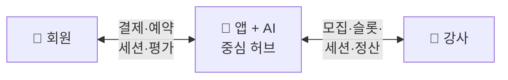

# PT Platform

## 시스템 요약 (한 번에 이해하기)

### 우리가 만드는 것

> **AI 기반 체계화된 운동을 private room에서 1:1 멘토와 받는 "개인 맞춤 세션" 서비스.**
> 서비스 카테고리 자체를 "개인 맞춤 세션"으로 정의. PT·반값 PT 같은 비교/할인 뉘앙스 ❌.
> 목표: 100호점 체인화.

### 누구를 위해

- **회원** — 주 2회 운동러. "헬스장은 북적, PT는 비싸다"를 해결.
- **강사** — 영업·정산·CS 부담 없는 **파트타임 잡** (배달기사 모델). 자격증 보유 + 본사 심사 통과 시 **Pro 인증 멘토** = 단가 자율 권한.
- **본사** — 강사풀·AI·브랜드·회원 데이터 **무형자산 보유**. 가맹점주는 공간 + 일상 운영("동전노래방" 수준)만.

### 어떻게 작동하는가

1. 회원이 앱에서 **회차권** 결제 (1·4·12·24·48회 — [ADR 0004](./decisions/0004-one-time-ticket-pricing.html)).
2. 매 세션마다 **강사 + 프로그램**을 자율 선택 (스트레칭·필라테스·1:1 PT·자유 헬스 등 — [ADR 0001](./decisions/0001-consumer-pivot.html)).
3. 시간 단위 = **30분 unit** — 60분 원할 시 2 unit 연속 예약.
4. 룸 필요 코스(스트레칭·필라테스 등) → 8 private room 자동 배정. 1:1 PT·자유 헬스 → 오픈 공간 배정.
5. 멘토가 세션 기록 → AI 누적 → **다음 세션 운동 자동 제안**. 멘토 바뀌어도 회원 운동 이력 연속.

### 어떻게 돈 버는가

- 회원 결제 → **본사 앱이 직접 수령** → 자동 분배 (멘토 · 본사 · 가맹점주).
- 표준 지점 = **60평** (8 private room × 4평 + 오픈 28평). **베타 1호점 = 평당 10만 외곽 입지** → 총 임대 약 600만/월, capex 약 1억 ([ADR 0006](./decisions/0006-beta-location-strategy.html)). 강남 (평당 35만·임대 2,100만·capex 3억) 은 Phase 2 진입 시 추가.
- 멘토 정산: **S1 파트타이머 12,000원/30분** ~ **S2 전문 강사 최대 20,000원/30분 상한** (등급·종목·utilization 의존).
- 회차권 라인업: 1회 4만 / 4회 14만 / 12회 36만 / 24회 65만 / 48회 120만 (회당 4만→2.5만).
- **Pro 인증 멘토** 옵션 = 회당 +5,000원 포인트 추가. 본사 추가 매출 + 강사 수익 인센티브.

### 확장 계획 (시점 미정, KPI 기준)

| Phase | 호점 | 모델 |
|---|---|---|
| 1 | 1-3 | **직영** PMF 검증 |
| 2 | 4-10 | 직영 + 가맹 1-2개 병행 |
| 3 | 10-30 | 가맹 70% + 직영 30% |
| 4 | 30-100 | 가맹 90% + 직영 10% (플래그십) |

### 핵심 차별점 (시장 빈자리)

```
저렴 (헬스장·짐박스)     중간            비쌈 (풀 PT 60-120만)
가이드 ❌                ?               1:1·체계화 있음
                                       강사 락인 부담
        ↓
     PT Platform 자리
     합리적 가격 × 체계화 × private + 1:1
```

- **AI 시스템 PT** — 매일 챙기는 코치 ❌. 세션 기록 누적 + 다음 운동 제안 (운동 = 회원에게 누적되는 자산).
- **강사 파트타임 모델** — 배달기사처럼 슬롯 자유 오픈. 자격증 보유 + 본사 심사 = Pro 인증 단가 자율.
- **예약 = 강사 + 프로그램** — 룸은 자동 배정. 30분 unit, 회원이 강도·시간 자유 조절.
- **본사 자산 보호** — 회원·강사·결제·AI 본사 보유 → 가맹점주·강사 우회 불가.

📊 [단위 경제 시뮬레이션](./economics/simulation.html) — 슬라이더로 가격·가동률·임대료 실시간 탐색

> **사업 OS** — 모든 핵심 결정이 여기에 정의됩니다. 결정 전엔 🔴 TBD, 결정 후엔 ADR로 봉인.

전체 결정 구조 → [결정 트리](./product/decision-tree.html)
**📊 [단위 경제 시뮬레이션](./economics/simulation.html)** — 슬라이더로 가격·가동률·임대료 실시간 탐색

---

## 서비스가 돌아가는 구조

세 주체 — **회원 · 앱 · 강사** — 가 앱을 중심으로 연결됩니다.



| 갈래 | 활동 |
|---|---|
| **회원** | 가입 → 예약 → 세션 → 개인화 추천 |
| **앱 (AI)** | 매칭 · 결제 · 데이터 누적 · 운동 설계 |
| **강사** | 등록·검증 → 슬롯 오픈 → 세션·기록 → 정산 |

→ 앱이 모든 매칭·결제·데이터를 중개. 강사 우회 방지 + 회원 데이터 본사 보유 + AI 학습 루프.

---

## 결정 영역 한눈에

**범례** — 🟢 결정 / 🟡 부분 / 🔴 미결정 / ⚪ 외부 의존

### 1. 제품 (Product)

- 🟢 [정체성 — 예약제 private PT shop with AI](./product/identity.html)
- 🟢 [비전 — 100호점 확장](./product/vision.html)
- 🟢 [1A 페르소나 — 주 2회 + 체계화 + PT는 비싼 사람](./product/personas.html)
- 🟢 [1B 문제의식 — 회원 페인 2종](./product/problems.html)
- 🟢 [1C 경쟁 비교 — 가격 × 체계화 × private](./product/competition.html)
- 🟢 [1D Value Proposition](./product/value-prop.html)
- 📋 [결정 트리](./product/decision-tree.html) · [로드맵 (3-Track)](./product/roadmap.html)

### 2. 회원 (Members)

- 🟢 [2A 회원 여정 — 8단계](./members/journey.html)
- 🟢 [2B 멤버십 — 회차권 5단 (1·4·12·24·48회)](./members/membership.html)
- 🔴 [2C 가격 — 시뮬레이션 기준 가설치](./members/pricing.html)
- 🟢 [2D 환불·노쇼·취소 (48h/6h)](./members/policies.html)

### 3. 강사 (Partners) — 강사도 우리 고객

- 🟢 [3A 강사 페르소나 — 파트타임 잡 (배달기사형)](./partners/personas.html)
- 🟢 [3B 강사 문제의식](./partners/problems.html)
- 🟢 [3C 강사 VP — Pro 인증 자율 단가](./partners/value-prop.html)
- 🔴 [3D 모집 — 기존 헬스장 4개 활용](./partners/recruitment.html)
- 🟢 [3E 운영 모델 — Hybrid Phase별](./partners/model.html)
- 🟡 [3F 일반 멘토 — 검증 코스 TBD](./partners/peer-leader.html)
- 🟡 [3G 정산 — 구조 락, 숫자 TBD](./partners/payout.html)
- 🔴 [3H 품질·등급 — 원칙만 락](./partners/quality.html)

### 4. 서비스 (Service / What)

- 🟢 [4A 세션 종류 — 다종목 코스 (가변·admin 추가)](./service/session-types.html)
- 🟢 [4B 세션 포맷 — 30분 unit](./service/session.html)
- 🟢 [4C AI — 시스템 PT (세션 기록 + 다음 운동 제안)](./service/ai-role.html)
- 🟢 [4D 공간 — 60평 (8 private room + 오픈 28평)](./service/space.html)

### 5. 운영 (Operations)

- 🟢 [5A 예약 시스템 — 피크 고정 슬롯 + 연속성](./operations/reservation.html)
- 🔴 [5B 지점 운영 — 무인/유인·시간·SOP](./operations/store.html)
- 🔴 [5C 안전·보험·사고처리](./operations/safety.html)

### 6. 비즈니스 모델 (Expansion)

- 🟢 [6A 확장 모델 — 하이브리드 4-Phase](./expansion/model.html)
- 🟢 [6B R&R — 본사 강 통제, 가맹점주 "동전노래방"](./expansion/responsibility.html)
- 🔴 [6C 본사 수익 모델 — 숫자 TBD](./expansion/revenue-share.html)

### 7. 경제성 (Economics) — 공간 임대업

- 📊 [단위 경제 시뮬레이션 — 인터랙티브 슬라이더](./economics/simulation.html) ★
- 🟡 [7A 단위 경제 — 60평 / 멘토 30분 모델](./economics/unit-economics.html)
- 🔴 [7B 매출·원가 모델](./economics/revenue-cost.html)
- 🔴 [7C 100호점 추정 — BEP / CapEx](./economics/projection.html)

---

## 별도 섹션

### ⚖️ 법무·약관 — 외부 검토 필수
- ⚪ [8A 가맹사업법 / 정보공개서](./legal/franchise-law.html)
- ⚪ [8B PT 자격증 법규](./legal/pt-license.html)
- ⚪ [8C 개인정보 / 이용약관](./legal/privacy-tos.html)

### 📐 스펙 (PRD)
- [Spec 인덱스](./specs/)

### 📌 결정 기록 (ADR)
- [ADR 인덱스](./decisions/)

---

## 남은 결정 (우선순위)

1. **2C 가격 락** — 회차권 5단 라인업 확정 ([ADR 0004](./decisions/0004-one-time-ticket-pricing.html)); 시뮬레이션 보정
2. **7B 매출·원가 모델** — 단위 경제 확장
3. **7C 100호점 추정** — 자본 소요·BEP 시점
4. **5B 지점 운영 + 5C 안전** — 1호점 직전
5. **3D 모집 디테일** — 1호점 직전
6. **6C 본사 수익 모델** — 가맹 시작 전 (Phase 2 직전)
7. **8 법무** — 사업자 등록 / 결제 연동 시

---

## 라이브 앱

- [유저 앱](https://pt-platform-mvp.vercel.app) · [강사 앱](https://pt-platform-partner.vercel.app) · [어드민](https://pt-platform-admin.vercel.app)

---

협업자라면 [온보딩 가이드](./onboarding.html)를 먼저 읽어주세요.

{: .warning }
> 본 문서는 PT Platform 내부 문서입니다. 외부 공유 시 사전 협의가 필요합니다.
