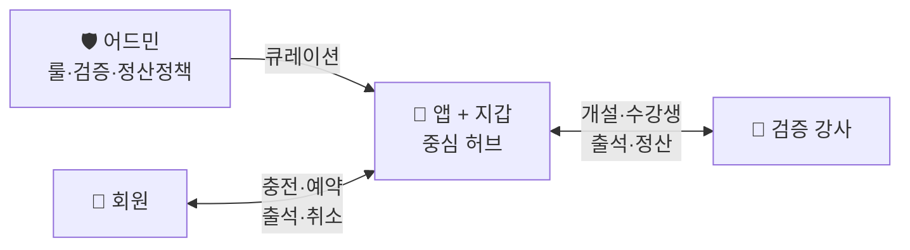

# recoverGX

{: .warning }
> **2026-06 GX 피벗** — 이 제품은 1:1 PT에서 **오픈형 GX 그룹 클래스 플랫폼**으로 전환됐다. 최상위 결정 → [ADR 0011 recoverGX GX 피벗](./decisions/0011-recovergx-gx-pivot.html). ADR 0001~0010 및 일부 하위 문서는 **1:1 PT 레일(보류)** 기준이니 그 관점으로 읽을 것.

## 시스템 요약 (한 번에 이해하기)

### 우리가 만드는 것

> **검증된 강사가 여는 그룹 클래스를, 회원이 충전금으로 골라 드롭인하는 오픈형 GX 플랫폼.**
> 슈퍼몽키 초창기형 — **"강매 없음·연장 압박 없음·충전해서 쓰는 만큼만."**
> 어드민이 품질 룰을 깔고(큐레이션), 강사가 그 안에서 클래스를 개설한다.

### 누구를 위해

- **회원** — 혼자선 안 빠지는 작심삼일형. 약정·티어 없이 1회씩 드롭인.
- **강사** — 검증(개설 권한) 통과 시 본인 클래스를 직접 개설·운영. 조합형 정산.
- **본사** — 강사 검증·룰·결제·정산·데이터 보유. 강사·가맹점주 우회 불가.

### 어떻게 작동하는가

1. 어드민이 **룰**을 만든다: 카테고리 · 가격 상한/하한 · 강사 검증 · 충전 패키지 · 정산 정책 · 환불 마감 ([ADR 0011](./decisions/0011-recovergx-gx-pivot.html)).
2. **검증된 강사**가 룰 안에서 그룹 클래스를 개설 (지점·룸·카테고리·시간·정원·가격).
3. 회원이 **지점 → 날짜 → 시간표**에서 열린 클래스를 탐색(잔여석) → **충전금**으로 드롭인 예약.
4. 룸당 시간당 1세션(배타), 정원 N명(기본 20). 클래스별 가격이 다름.
5. 클래스 완료 → 출석 기반 **조합형 정산**(기본금 + 인당 + 매출 비율%) 자동 계산.

### 어떻게 돈 버는가

- 회원이 **정액 패키지로 지갑 충전** → 클래스별 가격만큼 차감. 환불은 지갑 즉시 크레딧.
- **클래스당 1~5만원** (강사 지정, 어드민 범위 내). 충전 패키지 5만/10만(+5천)/30만(+3만).
- **강사 정산** = 기본금 + (인당 × 출석) + (매출 × 비율%). 플랫폼 마진 = 매출 − 지급액.
- 표준 지점 = 60평. 단위 경제 → [경제성](./economics/) (GX 정원·드롭인 기준 재산출 대상).

📊 [단위 경제 시뮬레이션](./economics/simulation.html) — 슬라이더로 가격·가동률·임대료 실시간 탐색

### 핵심 차별점

```
저렴 (헬스장·짐박스)        중간              비쌈 (풀 PT 60-120만)
혼자·작심삼일             ?                강사 락인·약정 부담
        ↓
   recoverGX 자리
   같이 운동 × 투명 가격 × 약정 없는 드롭인 × 큐레이션 품질
```

---

## 서비스가 돌아가는 구조

세 주체 — **회원 · 앱 · 강사** — 가 앱을 중심으로 연결되고, **어드민이 룰을 깐다.**



| 갈래 | 활동 |
|---|---|
| **어드민** | 카테고리·가격범위·강사 검증·충전 패키지·정산 정책·환불 마감 |
| **회원** | 충전 → 시간표 탐색 → 드롭인 예약 → 출석 → (취소 시 정책 환불) |
| **앱 (지갑)** | 잔액 차감/환불 · 정원 점유 · 거래 원장 · 정산 계산 |
| **강사** | 검증 → 클래스 개설 → 수강생·출석 → 완료/폐강 → 정산 |

→ 앱이 모든 결제·정원·정산을 중개. 강사 우회 방지 + 데이터 본사 보유.

---

## 결정 영역 한눈에

**범례** — 🟢 결정 / 🟡 부분 / 🔴 미결정 / ⚪ 외부 의존

### 1. 제품 (Product)
- 🟢 [정체성 — 오픈형 GX 그룹 클래스 플랫폼](./product/identity.html)
- 🟢 [비전 — 100호점 확장](./product/vision.html)
- 🟢 [페르소나 — 같이 운동해야 지속되는 사람](./product/personas.html)
- 🟢 [문제의식 — 강매·경직 스케줄·강사 복불복](./product/problems.html)
- 🟢 [경쟁 비교 — 투명 가격 × 약정 없음](./product/competition.html)
- 🟢 [Value Proposition](./product/value-prop.html)
- 📋 [결정 트리](./product/decision-tree.html) · [로드맵](./product/roadmap.html)

### 2. 회원 (Members)
- 🟢 [회원 여정](./members/journey.html)
- 🟢 [결제 — 지갑 충전금 + 클래스별 가격](./members/membership.html)
- 🟡 [가격 — 클래스당 1~5만 · 충전 패키지](./members/pricing.html)
- 🟢 [취소·환불·폐강 (6h 마감)](./members/policies.html)

### 3. 강사 (Partners)
- 🟢 [강사 페르소나](./partners/personas.html)
- 🟢 [강사 문제의식](./partners/problems.html)
- 🟢 [강사 VP — 클래스 개설·조합형 정산](./partners/value-prop.html)
- 🔴 [모집](./partners/recruitment.html)
- 🟢 [운영 모델](./partners/model.html)
- 🟢 [검증 — 개설 권한(gxOpenEnabled)](./partners/verification-course.html)
- 🟢 [정산 — 조합형 (기본금+인당+비율)](./partners/payout.html)
- 🟡 [품질·등급](./partners/quality.html)

### 4. 서비스 (Service)
- 🟢 [클래스 종류 — 카테고리별 GX](./service/session-types.html)
- 🟢 [클래스 포맷 — 정원 N·시간 단위](./service/session.html)
- 🟡 [AI — GX 레일 보류 (1:1 PT 자산)](./service/ai-role.html)
- 🟢 [공간 — 60평 / 룸 + 오픈](./service/space.html)

### 5. 운영 (Operations)
- 🟢 [예약 — 시간표 드롭인 + 정원 점유](./operations/reservation.html)
- 🔴 [지점 운영](./operations/store.html)
- 🔴 [안전·보험](./operations/safety.html)

### 6. 비즈니스 모델 (Expansion)
- 🟢 [확장 모델](./expansion/model.html)
- 🟢 [R&R](./expansion/responsibility.html)
- 🔴 [본사 수익 모델](./expansion/revenue-share.html)

### 7. 경제성 (Economics)
- 📊 [단위 경제 시뮬레이션](./economics/simulation.html) ★
- 🟡 [단위 경제 — GX 정원·드롭인 모델](./economics/unit-economics.html)
- 🔴 [매출·원가 모델](./economics/revenue-cost.html)
- 🔴 [100호점 추정](./economics/projection.html)

---

## 별도 섹션

### ⚖️ 법무·약관
- ⚪ [가맹사업법 / 정보공개서](./legal/franchise-law.html)
- ⚪ [PT 자격증 법규](./legal/pt-license.html)
- ⚪ [개인정보 / 이용약관](./legal/privacy-tos.html)

### 📐 스펙 (PRD)
- [Spec 인덱스](./specs/) — GX 구현 정본은 레포 `docs/superpowers/specs/2026-06-03-recovergx-open-gx-platform-design.md`

### 📌 결정 기록 (ADR)
- [ADR 인덱스](./decisions/) — 최신 [ADR 0011 recoverGX GX 피벗](./decisions/0011-recovergx-gx-pivot.html)

---

## 남은 결정 (우선순위)

1. **가격·정산 정책 실데이터 보정** — GX 정원·드롭인 기준 단위 경제 재산출
2. **API ECS 배포 + 실 PG 연동** (현 mock)
3. **recoverGX 브랜딩(오렌지) 3앱 적용**
4. **지점 운영 + 안전** — 1호점 직전
5. (옵션) 노쇼 패널티 · 무우개과(변경권) 등급제

---

## 라이브 앱

- [유저 앱](https://pt-platform-mvp.vercel.app) · [강사 앱](https://pt-platform-partner.vercel.app) · [어드민](https://pt-platform-admin.vercel.app)

---

협업자라면 [온보딩 가이드](./onboarding.html)를 먼저 읽어주세요.

{: .warning }
> 본 문서는 recoverGX 내부 문서입니다. 외부 공유 시 사전 협의가 필요합니다.
