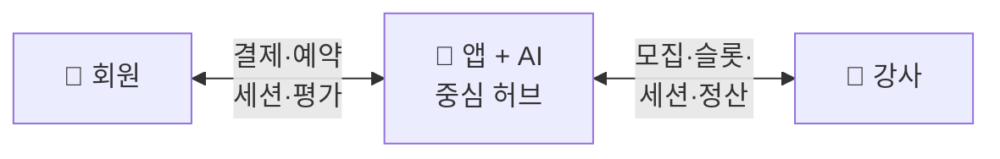

# PT Platform

  
AI 기반 체계화된 운동을, private room에서 1:1 멘토와.

  
서비스 카테고리 = <b>개인 맞춤 세션</b>. 목표 = 100호점 체인화.

  

    
<h4>🎯 회원에게</h4>
비싸지 않은 1:1 체계 운동 + 북적임 없는 private room

    
<h4>💪 강사에게</h4>
영업·정산 부담 없는 파트타임 잡. Pro 인증 시 단가 자율.

    
<h4>🏢 본사에게</h4>
강사풀·AI·브랜드 자산 보유. 가맹점주 = "동전노래방" 운영.

  

  

    <b>핵심 매커니즘:</b> AI가 운동 설계 → 멘토는 30분 1:1만 (시간당 2회원) → 회원은 데이터 누적 + 다음 운동 자동 추천. 강사 풀타임 ❌, 회원 매번 처음부터 ❌.
  

  

    

90분

1세션 (카디오 30 + 방 60)

    

8방

표준 90평 지점

    

24만

주 2회권 / 월 (가설)

    

100호점

목표 (가맹)

  

> **사업 OS** — 모든 핵심 결정이 여기에 정의됩니다. 결정 전엔 🔴 TBD, 결정 후엔 ADR로 봉인.

전체 결정 구조 → [결정 트리](./product/decision-tree.html)
**📊 [단위 경제 시뮬레이션](./economics/simulation.html)** — 슬라이더로 가격·가동률·임대료 실시간 탐색

---

## 서비스가 돌아가는 구조

세 주체 — **회원 · 앱 · 강사** — 가 앱을 중심으로 연결됩니다.

| 갈래 | 활동 |
|---|---|
| **회원** | 가입 → 예약 → 세션 → 개인화 추천 |
| **앱 (AI)** | 매칭 · 결제 · 데이터 누적 · 운동 설계 |
| **강사** | 등록·검증 → 슬롯 오픈 → 세션·기록 → 정산 |

→ 앱이 모든 매칭·결제·데이터를 중개. 강사 우회 방지 + 회원 데이터 본사 보유 + AI 학습 루프.

---

## 결정 영역 한눈에

**범례** — 🟢 결정 / 🟡 부분 / 🔴 미결정 / ⚪ 외부 의존

### 1. 제품 (Product)

- 🟢 [정체성 — 예약제 private PT shop with AI](./product/identity.html)
- 🟢 [비전 — 100호점 확장](./product/vision.html)
- 🟢 [1A 페르소나 — 주 2회 + 체계화 + PT는 비싼 사람](./product/personas.html)
- 🟢 [1B 문제의식 — 회원 페인 2종](./product/problems.html)
- 🟢 [1C 경쟁 비교 — 가격 × 체계화 × private](./product/competition.html)
- 🟢 [1D Value Proposition](./product/value-prop.html)
- 📋 [결정 트리](./product/decision-tree.html) · [로드맵 (3-Track)](./product/roadmap.html)

### 2. 회원 (Members)

- 🟢 [2A 회원 여정 — 8단계](./members/journey.html)
- 🟢 [2B 멤버십 — 주 1회권 / 주 2회권 + 포인트](./members/membership.html)
- 🔴 [2C 가격 — 시뮬레이션 기준 가설치](./members/pricing.html)
- 🟢 [2D 환불·노쇼·취소 (48h/6h)](./members/policies.html)

### 3. 강사 (Partners) — 강사도 우리 고객

- 🟢 [3A 강사 페르소나 — 파트타임 잡 (배달기사형)](./partners/personas.html)
- 🟢 [3B 강사 문제의식](./partners/problems.html)
- 🟢 [3C 강사 VP — Pro 인증 자율 단가](./partners/value-prop.html)
- 🔴 [3D 모집 — 기존 헬스장 4개 활용](./partners/recruitment.html)
- 🟢 [3E 운영 모델 — Hybrid Phase별](./partners/model.html)
- 🟡 [3F 일반 멘토 — 검증 코스 TBD](./partners/peer-leader.html)
- 🟡 [3G 정산 — 구조 락, 숫자 TBD](./partners/payout.html)
- 🔴 [3H 품질·등급 — 원칙만 락](./partners/quality.html)

### 4. 서비스 (Service / What)

- 🟢 [4A 세션 종류 — 1:1 멘토링 단일 카테고리](./service/session-types.html)
- 🟢 [4B 세션 포맷 — 카디오 30 + 방 60](./service/session.html)
- 🟢 [4C AI — 시스템 PT (세션 기록 + 다음 운동 제안)](./service/ai-role.html)
- 🟢 [4D 공간 — 90평 8방 + 카디오 6자리](./service/space.html)

### 5. 운영 (Operations)

- 🟢 [5A 예약 시스템 — 피크 고정 슬롯 + 연속성](./operations/reservation.html)
- 🔴 [5B 지점 운영 — 무인/유인·시간·SOP](./operations/store.html)
- 🔴 [5C 안전·보험·사고처리](./operations/safety.html)

### 6. 비즈니스 모델 (Expansion)

- 🟢 [6A 확장 모델 — 하이브리드 4-Phase](./expansion/model.html)
- 🟢 [6B R&R — 본사 강 통제, 가맹점주 "동전노래방"](./expansion/responsibility.html)
- 🔴 [6C 본사 수익 모델 — 숫자 TBD](./expansion/revenue-share.html)

### 7. 경제성 (Economics) — 공간 임대업

- 📊 [단위 경제 시뮬레이션 — 인터랙티브 슬라이더](./economics/simulation.html) ★
- 🟡 [7A 단위 경제 — 90평 / 멘토 30분 모델](./economics/unit-economics.html)
- 🔴 [7B 매출·원가 모델](./economics/revenue-cost.html)
- 🔴 [7C 100호점 추정 — BEP / CapEx](./economics/projection.html)

---

## 별도 섹션

### ⚖️ 법무·약관 — 외부 검토 필수
- ⚪ [8A 가맹사업법 / 정보공개서](./legal/franchise-law.html)
- ⚪ [8B PT 자격증 법규](./legal/pt-license.html)
- ⚪ [8C 개인정보 / 이용약관](./legal/privacy-tos.html)

### 📐 스펙 (PRD)
- [Spec 인덱스](./specs/)

### 📌 결정 기록 (ADR)
- [ADR 인덱스](./decisions/)

---

## 남은 결정 (우선순위)

1. **2C 가격 락** — 시뮬레이션 추천 (멘토 20k·표준 → 주 2회 24만 / 주 1회 12만)
2. **7B 매출·원가 모델** — 단위 경제 확장
3. **7C 100호점 추정** — 자본 소요·BEP 시점
4. **5B 지점 운영 + 5C 안전** — 1호점 직전
5. **3D 모집 디테일** — 1호점 직전
6. **6C 본사 수익 모델** — 가맹 시작 전 (Phase 2 직전)
7. **8 법무** — 사업자 등록 / 결제 연동 시

---

## 라이브 앱

- [유저 앱](https://pt-platform-mvp.vercel.app) · [강사 앱](https://pt-platform-partner.vercel.app) · [어드민](https://pt-platform-admin.vercel.app)

---

협업자라면 [온보딩 가이드](./onboarding.html)를 먼저 읽어주세요.

{: .warning }
> 본 문서는 PT Platform 내부 문서입니다. 외부 공유 시 사전 협의가 필요합니다.
