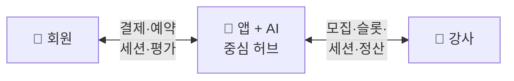

# PT Platform — 결정 대시보드

> **예약제 private PT shop with AI** — AI 기반 운동 세션을 핵심으로 하는 회원제 부티크 PT 서비스.
> 목표: **100호점 이상 체인화** (가맹 모델 활용 가능).

{: .note }
> **사업 OS** — 모든 핵심 결정이 여기에 정의됩니다. 결정 전엔 🔴 TBD, 결정 후엔 ADR로 봉인.

전체 결정 구조 → [결정 트리](./product/decision-tree.html)
**📊 [단위 경제 시뮬레이션](./economics/simulation.html)** — 슬라이더로 가격·가동률·임대료 실시간 탐색

---

## 서비스가 돌아가는 구조

세 주체 — **회원 · 앱 · 강사** — 가 앱을 중심으로 연결됩니다.

| 갈래 | 활동 |
|---|---|
| **회원** | 가입 → 예약 → 세션 → 개인화 추천 받음 |
| **앱 (AI)** | 매칭 · 결제 · 데이터 누적 · 운동 설계 |
| **강사** | 등록·검증 → 슬롯 오픈 → 세션·기록 → 정산 |

→ 회원·강사가 직접 만나지 않고 **앱이 모든 매칭·결제·데이터를 중개**. 이 구조가 강사 우회 방지 + 회원 데이터 본사 보유 + AI 학습 루프를 동시에 가능하게 함.

---

## 결정 영역 한눈에

**범례** — 🟢 결정 / 🟡 부분 / 🔴 미결정 / ⚪ 외부 의존
**우선순위**: 회원·강사·서비스 카테고리에서 **user flow가 1순위 페이지**.

### 1. 제품 (Product)

- 🟢 [정체성 — 예약제 private PT shop with AI](./product/identity.html)
- 🟢 [비전 — 100호점 확장](./product/vision.html)
- 🟡 [페르소나 — Middle Ground Mover (구체화 진행)](./product/personas.html) ★
- 🟡 [문제의식 — 수요·공급 두 관점](./product/problems.html)
- 🟡 [경쟁 비교 — 가격 × 운동 체계화](./product/competition.html)
- 🔴 [Value Proposition](./product/value-prop.html)
- 📋 [결정 트리](./product/decision-tree.html) · [로드맵 (3-Track)](./product/roadmap.html)

### 2. 회원 (Members)

- 🔴 [회원 여정 — 가입 → 재예약](./members/journey.html) ★ user flow
- 🔴 [멤버십 구조](./members/membership.html)
- 🔴 [가격 체계 — 재검토 필요](./members/pricing.html)
- 🔴 [환불·노쇼·취소·일시정지·양도](./members/policies.html)

### 3. 강사 (Partners) — 강사도 우리 고객

- 🔴 [강사 페르소나](./partners/personas.html) ★ user flow
- 🔴 [강사 문제의식](./partners/problems.html)
- 🔴 [강사 Value Proposition](./partners/value-prop.html)
- 🔴 [강사 모집 전략](./partners/recruitment.html)
- 🔴 [Pro 강사 모델](./partners/model.html)
- 🔴 [Peer 운동 리더 모델](./partners/peer-leader.html)
- 🔴 [강사 정산 구조](./partners/payout.html)
- 🔴 [강사 품질·등급](./partners/quality.html)

### 4. 서비스 (Service / What)

- 🔴 [세션 종류 — Pro PT vs Peer 운동](./service/session-types.html)
- 🟡 [세션 포맷 — 30분 카디오 + 60분 PT](./service/session.html)
- 🔴 [AI 역할 범위](./service/ai-role.html)
- 🔴 [공간 구조 — 방·테마·평수](./service/space.html)

### 5. 운영 (Operations)

- 🔴 [예약 시스템 — 피크 6-10pm 고정 슬롯 등](./operations/reservation.html) ★ user flow
- 🔴 [지점 운영 — 무인/유인·시간·SOP](./operations/store.html)
- 🔴 [안전·보험·사고처리](./operations/safety.html)

### 6. 비즈니스 모델 (Expansion)

- 🔴 [확장 모델 — 직영 vs 가맹 vs 하이브리드](./expansion/model.html)
- 🔴 [본사 ↔ 가맹점주 책임 분담](./expansion/responsibility.html)
- 🔴 [본사 수익 모델](./expansion/revenue-share.html)

### 7. 경제성 (Economics)

> 핵심: **공간 임대업** — 평당 비용 ↓ × 평당 수익 ↑ × utilization ↑

- 🔴 [단위 경제 — 지점당 P&L](./economics/unit-economics.html)
- 🔴 [매출·원가 모델](./economics/revenue-cost.html)
- 🔴 [100호점 추정 — BEP / CapEx](./economics/projection.html)

---

## 별도 섹션

### 📐 스펙 (PRD) — 실제 기능 명세
- [Spec 인덱스](./specs/) (PRD 템플릿 + 작성된 PRD)

### ⚖️ 법무·약관 — 외부 검토 필수
- [가맹사업법 / 정보공개서](./legal/franchise-law.html)
- [PT 자격증 법규](./legal/pt-license.html)
- [개인정보 / 이용약관](./legal/privacy-tos.html)

### 📌 결정 기록 (ADR)
- [ADR 인덱스](./decisions/)

---

## 우선 결정 순서

1. **1A 회원 페르소나 구체화** ★ — 모든 결정의 시작점
2. **3A 강사 페르소나** — 1A에서 derived
3. **3E 강사 모델 + 4A 세션 종류** — 동시 결정
4. **2B 멤버십 + 2C 가격** — 페르소나·강사 정해진 후
5. **7A 단위 경제** — 가격·원가 검증
6. **5A 예약 시스템**
7. **6A 확장 모델 (직영/가맹)**
8. **법무 (8A/8B/8C)** — 변호사 검토

---

## 라이브 앱

- [유저 앱](https://pt-platform-mvp.vercel.app) · [강사 앱](https://pt-platform-partner.vercel.app) · [어드민](https://pt-platform-admin.vercel.app) · [수익 시뮬레이터](https://pt-platform-simulator.vercel.app)

---

협업자라면 [온보딩 가이드](./onboarding.html)를 먼저 읽어주세요.

{: .warning }
> 본 문서는 PT Platform 내부 문서입니다. 외부 공유 시 사전 협의가 필요합니다.
