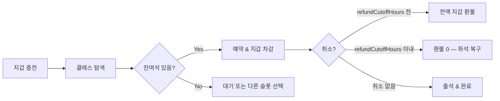

# 2A. 회원 여정

**🟢 GX 피벗 (2026-06-04)** · 의존: [ADR 0001](../decisions/0001-consumer-pivot.html), [ADR 0011](../decisions/0011-recovergx-gx-pivot.html), [2B 지갑](./membership.html), [2D 정책](./policies.html), [4C AI](../service/ai-role.html) → 앱 UX, CS SOP

{: .note }
1:1 PT 회원 여정(회차권 기반)은 GX 피벗([ADR 0011](../decisions/0011-recovergx-gx-pivot.html))으로 보류. 코드는 보존. 본 문서는 **recoverGX 오픈형 그룹 클래스** 여정 기준.

## 7단계 여정

| 단계 | 액션 | 비고 |
|---|---|---|
| **1. 인지** | 인스타·구글·입소문 (1A 페르소나 채널) | |
| **2. 첫 방문** | 앱/웹에서 지점·날짜·시간표 탐색, 잔여석 확인 | 회원가입 필요 |
| **3. 첫 충전** | 패키지 선택 후 지갑 충전 (mock PG) | 약정 없음 |
| **4. 드롭인 예약** | 원하는 클래스 선택 → 지갑 잔액 차감 → 예약 확정 | 좌석 확보 즉시 |
| **5. 출석 & 세션** | QR / 강사 체크인, 클래스 수강 | |
| **6. 반복** | 잔액 소진 시 재충전 알림, AI 다음 클래스 추천 | 약정·연장 압박 ❌ |
| **7. 이탈** | 사유 서베이 (옵션), 지갑 잔액 환불 정책(2D) 안내, 6개월 후 콜백 | |

## 예약 ~ 취소 흐름

## 톤

- **드롭인 자유** — 약정·갱신 압박 없이 충전 잔액으로 원하는 클래스를 원하는 때 예약
- **AI-first** — 재방문 추천·체크인은 AI 1차
- **위기 시 인간 백업** — 만족도 ↓ 또는 폐강 발생 시 CS 직접 연락

---

| 날짜 | 변경 |
|---|---|
| 2026-05-12 | 8단계 여정 + AI-first 톤 (1:1 PT 기준) |
| 2026-05-16 | v2 본문 정합 갱신 — 회차권 5단 ([ADR 0004](../decisions/0004-one-time-ticket-pricing.html)) |
| 2026-06-04 | **GX 피벗** — 충전금 드롭인 7단계 여정으로 전면 교체. 1:1 PT 여정 보류 ([ADR 0011](../decisions/0011-recovergx-gx-pivot.html)) |
