# 5F. 1호점 런칭 플랜 — 일정 · 소요 리소스 · 예산

**🟢 신규 (2026-06-04)** · 의존: [ADR 0011](../decisions/0011-recovergx-gx-pivot.html), [5E OPEN 체크리스트](./launch-checklist.html), [7B 매출·원가](../economics/revenue-cost.html), [7A 단위 경제](../economics/unit-economics.html)

> 방향성(오픈형 GX·지갑 충전·강사 개설·조합형 정산)이 얼라인된 상태에서 **1호점 베타 런칭**을 위한 실행 플랜. 일정·팀·자금을 한 장에 모은다. 작업 단위 세부 체크는 [5E OPEN 체크리스트](./launch-checklist.html) 참조.

{: .warning }
> **GX 단위경제는 재산출 대상.** 아래 매출/순익/BEP의 구체 수치는 1:1 PT 30분 unit 기준 추정치이며, GX(클래스 가격 × 출석 인원) 모델로 재산출 전이다 ([ADR 0011](../decisions/0011-recovergx-gx-pivot.html)). **Capex·고정비(시설 측)는 모델 무관**하므로 그대로 유효. 매출 측은 베타 실측 후 확정.

---

## 0. 현황 전제

| 항목 | 상태 |
|---|---|
| 제품 (회원·강사·어드민 3앱 + API + DB) | ✅ 코드 완성 (GX 전환 머지·검증 완료) |
| 방향성 (GX 오픈 플랫폼) | ✅ 얼라인 (ADR 0011 봉인) |
| GX 단위경제 (정원·가격·정산 배합) | 🟡 베타 실측 후 확정 |
| 인프라 배포 (ECS·Vercel) | 🔴 미배포 (다음 단계) |
| 공간·법무·자금 | 🔴 미착수 |

→ **남은 것은 거의 "운영·자본" 측면.** 제품 리스크가 아니라 실행 리스크.

---

## 1. 예상 일정 (목표 ~12주 / 현실 4~5개월)

{: .warning }
> **3개월은 "모든 게 순조로울 때의 공격적 목표".** Critical path가 제품이 아니라 **공간·행정**(임대·체육시설업 신고·시공)이라 압축이 안 된다. 임대 체결만 늦어도 전체가 밀린다. 임대 2~4주 + 체육시설업 신고 2~6주(지자체 편차) + 시공 4~6주 → **현실선은 4~5개월** 버퍼 권장.

D-Day 기준. 자본·입지·법무가 critical path(가장 오래 걸림).

```mermaid
gantt
    dateFormat  X
    axisFormat  W%W
    section 자본·법무
    자금·법인·입지·PG·변호사        :p0, 0, 4
    section 공간·인프라
    인테리어·기구·앱 배포·강사모집   :p1, 4, 4
    section 강사·콘텐츠
    seed 강사 큐레이션·admin 설정·dry run :p2, 8, 3
    section 런칭
    마케팅 점화·최종점검·OPEN        :p3, 11, 1
    section 오픈마켓(병렬)
    강사 자가신청·검증큐·self-개설   :pm, 4, 9
```

| Phase | 기간 | 핵심 산출물 | 비고 |
|---|---|---|---|
| **0. 자본·법무** | Week 1–4 (D-90~D-60) | 사업자·체육시설업 신고, 임대 계약, capex 예산 확보, PG 계약, 약관·면책 자문 | **critical path** — 임대·인허가·시공 발주가 전체를 결정 |
| **1. 공간·인프라** | Week 5–8 (D-60~D-30) | 인테리어 시공, 기구 입고, ECS/Vercel prod 배포, 도메인·SSL, 강사 15명 모집 시작 | 시공(4~6주)과 강사 모집 병렬 |
| **2. 강사·콘텐츠** | Week 9–11 (D-30~D-7) | 아카데미 8h(P1 부여), admin 카테고리·가격범위·정산정책·충전패키지 입력, 클래스 시간표 첫 배치, dry run e2e | [5E 체크리스트] D-30~D-14 구간 |
| **3. 런칭** | Week 12 (D-7~D-Day) | KOL·B2B 마케팅 점화, 사전신청 페이지, CS 채널·SOP, 최종 점검, **OPEN** | [5E 체크리스트] D-7~D-Day 구간 |

> 시공 리드타임·인허가 속도에 따라 ±2~4주 변동. 임대 계약 체결이 늦어지면 전체가 밀린다.

### 1-1. 강사 공급 — 오픈마켓 (병렬 트랙, 런칭 게이트 아님)

recoverGX는 강사를 **오픈마켓**으로 모은다: 강사 자가 가입 → 자격 증빙 → 어드민 검증(`gxOpenEnabled`) → **클래스 자가 개설**. 큐레이션 인프라(검증·카테고리·가격범위·정산정책)는 [이미 구현됨](../specs/api/catalog.html). 미구현은 **강사용 자가 온보딩 플로우 + 검증 큐 UI**.

{: .note }
> **콜드스타트 주의 — 1호점은 공급이 무한이 아니다.** 단일 지점은 room-hours(룸×시간)가 물리적 상한이라, 첫 시간표는 "수동 큐레이션한 seed 강사"로 채운다(닫힌 방식). 오픈마켓 자가신청은 W5부터 **병렬**로 펼쳐 대기 풀을 쌓고 OPEN 전후 self-service 개설을 켠다. 진짜 마켓플레이스 다이내믹(공급 무한 확장)은 **n호점**부터 의미.

| 구간 | 공급 방식 | 목적 |
|---|---|---|
| 런칭 (W9~W12) | seed 강사 수동 큐레이션 | 첫 시간표 확정 (런칭 게이트) |
| 병렬 (W5~) | 오픈마켓 자가신청·검증 큐 | 대기 풀 형성, OPEN 후 self-개설 |
| 확장 (n호점) | 오픈마켓 본격 가동 | 공간↑ → 공급 무한 확장 |

→ 오픈마켓을 **런칭에 직렬로 넣으면 3달이 깨지고, 병렬 트랙으로 빼면 3달(seeded) 유지** + 오픈마켓은 상시 성장 함수.

---

## 2. 런칭 체크리스트 (영역별)

세부 완료 기준은 [5E OPEN 체크리스트](./launch-checklist.html)에 D-day 단위로 정리. 여기선 영역별 게이트만.

- [ ] **자본·법무** — 사업자등록·체육시설업 신고 / 임대 계약 / 약관·면책동의 final / PG(토스·포트원) 계약+webhook
- [ ] **공간** — 인테리어 시공 완료 / 운동기구 입고·점검 / 안전(AED·비상벨·구급함)
- [ ] **인프라** — ECS API 배포(`/health` 200) / Vercel 3앱 prod / 도메인·SSL / Supabase 운영 프로젝트·migration·seed / Solapi 카톡 알림
- [ ] **강사 (런칭 seed)** — 첫 시간표용 seed 강사 수동 큐레이션·검증 / 가맹점장(Pro+시설법§26) 채용 / 등급·정산정책 부여
- [ ] **강사 (오픈마켓, 병렬)** — 강사 자가 온보딩 플로우·검증 큐 UI 구축 / 강사 획득 채널·인센티브 / W5부터 자가신청 펼침
- [ ] **콘텐츠·설정** — admin 카테고리·가격범위(GxPolicy)·검증·충전패키지·정산정책 입력 / 클래스 시간표 첫 배치 / dry run(지갑 차감→예약→체크인→기록) e2e
- [ ] **마케팅·CS** — KOL 2~3명 / B2B 사전영업 1~2곳 / 사전신청(체험 드롭인 1회) / CS 채널·SOP 5종 / 첫 콘텐츠 업로드
- [ ] **OPEN** — 첫 회원 체크인 / 첫 클래스 무사고 / 24h 회고

---

## 3. 소요 리소스 — 사람

| 역할 | 인원 | 고용 형태 | 비고 |
|---|---|---|---|
| Founder / 대표 | 1 | — | 총괄·자금·법무·입지·마케팅 |
| 가맹점장 | 1 | 본사 직고용 | Pro 자격 + 시설법 §26, 현장 운영 책임 |
| 본사 직강사 | 1 | 본사 | 아카데미 8h 운영·강사 심사 |
| GX 강사 풀 | 15 | 강사 계약(조합형 정산) | P1 신입 10 + P2~P3 시니어 5 |
| Dev | 1 | 현 체제 | 배포·모니터링·알림·CS 자동화 |
| CS / 운영 | 본사 분담 | — | 채널·SOP, 초기엔 가맹점장 겸임 가능 |

---

## 4. 소요 리소스 — 자금

### 4-1. 자본 지출 (Capex) — **1.5~2.0억** (1회성)

| 항목 | 금액 | 비고 |
|---|---|---|
| 인테리어·시공 | 1.0억 | 60평 외곽 기준 |
| 운동기구·장비 | 0.5억 | GX 그룹 클래스 구성 |
| 임대 보증금 + 기타 | 0.5억 | 보증금·초기 비품·예비 |
| **합계** | **1.5~2.0억** | [7A 단위경제](../economics/unit-economics.html) |

### 4-2. 월 운영비 (Opex) — **~2,600만/월**

{: .note }
> PT 레일 추정치. GX 인력 구조(클래스 운영)·CS 볼륨에 따라 재산출 대상. 시설 임대는 모델 무관.

| 항목 | 월 금액 | 비고 |
|---|---|---|
| 임대 (평당 10만 × 60평) | 600만 | |
| 인건비 (가맹점장·알바) | 600만 | GX 운영 인력 검토 |
| 관리비·공과·통신 | 400만 | |
| AI API·인프라 (본사 분담) | 300만 | ECS·Vercel·Supabase·Solapi |
| CS·운영 (본사 분담) | 400만 | |
| 보험·기타 | 300만 | |
| **합계** | **~2,600만/월** | [7B 매출·원가](../economics/revenue-cost.html) |

### 4-3. 런칭 마케팅 — **~2,000~3,000만** (제안, 초기 1회성)

{: .note }
> 제안치, 미확정. mix = KOL 60% / B2B 20% / 구전 15% / 광고 5%. KOL 콘텐츠·체험 드롭인 무상 제공·초기 광고 포함.

### 4-4. 운영 런웨이 (BEP 도달 전 예비비) — **~1.0~1.5억**

월 고정비 2,600만 × 4~6개월 버퍼. PT 기준 BEP 회수가 3~4개월이나, GX 실측 변동·초기 가동률 램프업을 감안한 안전 버퍼.

### 4-5. 총 초기 소요 자금

| 구성 | 금액 |
|---|---|
| Capex | 1.5~2.0억 |
| 런칭 마케팅 | 0.2~0.3억 |
| 운영 런웨이 | 1.0~1.5억 |
| **총계** | **약 2.7~3.8억 (≈ 3~4억)** |

---

## 5. 손익·회수 (참고 — GX 재산출 보류)

| 지표 | PT 레일 추정 | GX 상태 |
|---|---|---|
| 월 고정비 | 2,600만 | 시설 측 유효, 인건/CS 재산출 |
| BEP 가동률 | ~17.7% | 재산출 대상 |
| Capex 회수 | 3~4개월 (Base) | 재산출 대상 |
| D+180 목표 | 활성 360명 · util 50% · 순익 +4,744만 | KPI 유지, 단가 재산출 |

→ **다음 액션**: ① ECS 배포 + 실 PG 연동(제품 측 마지막 갭) ② 임대 계약·capex 예산 확정(자본 측 critical path) ③ GX 정원·클래스 가격·정산 배합 베타 가정 1차 확정 → 단위경제 재산출.

---

| 2026-06-04 | 초안 — 일정(12주)·팀·Capex 1.5~2억·Opex 2,600만/월·총 초기자금 3~4억. GX 매출 측은 재산출 보류 명기 |
| 2026-06-04 | 3개월=공격적 목표/현실 4~5개월 명기(공간·행정 critical path). 강사 공급을 오픈마켓 병렬 트랙으로 분리(런칭 게이트 아님), 콜드스타트(room-hours 상한) 전략 추가 |
