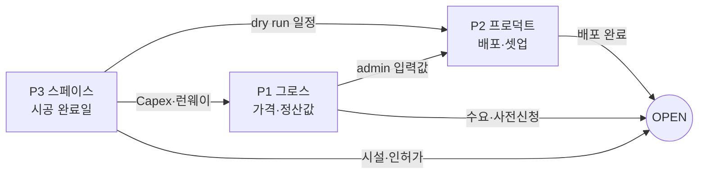

# 5G. 1호점 런칭 R&R — 3 포지션 분담

**🟢 신규 (2026-06-04)** · 의존: [5F 런칭 플랜](./launch-plan.html), [5E OPEN 체크리스트](./launch-checklist.html), [ADR 0011](../decisions/0011-recovergx-gx-pivot.html)

> [5F 런칭 플랜](./launch-plan.html)의 실행을 **3개 포지션**으로 나눠 책임을 귀속한다. 런칭 플랜의 다음 액션 3가지(①②③)를 각 포지션이 하나씩 오너십으로 가져간다.

## 포지션 = 영역 매핑

| 포지션 | 묶인 영역 | 한 줄 미션 | 담당 Next-Action |
|---|---|---|---|
| **P1 그로스** | 마케팅 + 포지셔닝/이코노믹스 | "수요를 만들고, 가격·단위경제를 설계한다" | **③ GX 단위경제 재산출** |
| **P2 프로덕트** | 프로덕션 + 프로그램 | "앱·인프라를 배포하고, 클래스 프로그램을 설계한다" | **① ECS 배포 + 실 PG 연동** |
| **P3 스페이스·운영** | 임대 (+법무·시공·현장) | "공간을 짓고, 합법적으로 안전하게 운영한다" | **② 임대 계약 + Capex 확정** |

---

## P1 — 그로스 (마케팅 + 포지셔닝/이코노믹스)

**오너십 next-action: ③ GX 정원·클래스 가격·정산 배합 베타 가정 확정 → 단위경제 재산출**

| 구분 | 내용 |
|---|---|
| 책임 영역 | 브랜드 포지셔닝(recoverGX), 가격 정책(GxPolicy 가격범위·충전패키지), 조합형 정산 배합 설계, 단위경제/BEP 재산출, 수요 창출(KOL 60% / B2B 20% / 구전 15% / 광고 5%), 사전신청·체험 드롭인, CS 메시징 |
| 핵심 과업 | ① 포지셔닝 1장(누구에게·왜 recoverGX) ② 클래스 가격표·충전패키지·정산 배합 1차 안 ③ GX 단위경제 재산출(정원·가동률·매출) ④ KOL 2~3명·B2B 1~2곳 파이프라인 ⑤ 사전신청 페이지·런칭 마케팅 캘린더 |
| 산출물 | 포지셔닝 문서 · 가격/정산 입력값(P2에 전달) · 단위경제 v2 · 마케팅 캘린더 · 사전신청 폼 |
| KPI | 사전신청 수 · CAC · D+180 활성 360명 · BEP 가동률 재산출치 |
| 예산 오너 | 런칭 마케팅 0.2~0.3억 · 운영 런웨이 1.0~1.5억 산정 |
| 협업 지점 | 가격·정산값 → **P2**(admin 입력) · 오픈 타이밍 → **P3** |

## P2 — 프로덕트 (프로덕션 + 프로그램)

**오너십 next-action: ① ECS API 배포 + Vercel 3앱 배포 + 실 PG(토스·포트원) 연동**

| 구분 | 내용 |
|---|---|
| 책임 영역 | 앱·인프라 배포(ECS·Vercel·Supabase·도메인·SSL), 실 PG 연동·webhook, Solapi 알림, 클래스 카테고리·프로그램 설계, 강사 아카데미 커리큘럼·심사, admin 룰 셋업, dry run e2e, 모니터링 |
| 핵심 과업 | ① ECS API(`/health` 200)·Vercel 3앱 prod ② PG 연동+테스트결제 ③ Supabase 운영 migration·seed ④ admin 카테고리·가격범위·정산정책·충전패키지 입력(P1 값) ⑤ 클래스 시간표 첫 배치 ⑥ 아카데미 8h·P1 등급 부여 ⑦ dry run(지갑 차감→예약→체크인→기록) |
| 산출물 | prod 배포(health 200) · PG webhook 로그 · seed·시간표 · 아카데미 4모듈 · dry run e2e 리포트 |
| KPI | 24h 무에러 배포 · 강사 15명 P1 부여 · dry run 5단계 통과 · 잔여 멱등성 갭 해소(부킹·refresh) |
| 예산 오너 | 인프라(ECS·Vercel·Supabase·Solapi) 월 ~300만(본사 분담) |
| 협업 지점 | 가격·정산값 ← **P1** · 시간표·정원 ↔ **P3**(공간 capacity) |

## P3 — 스페이스·운영 (임대)

**오너십 next-action: ② 임대 계약 체결 + Capex 예산 확정(1.5~2억 집행 계획)**

| 구분 | 내용 |
|---|---|
| 책임 영역 | 입지 선정·임대 계약, 사업자등록·체육시설업 신고·약관·면책 법무, 인테리어 시공·운동기구 입고, 안전(AED·비상벨·구급함), 현장 운영·CS 채널·SOP, 가맹점장 채용·관리 |
| 핵심 과업 | ① 60평 외곽 입지·임대 계약 ② Capex 예산 확정·시공 발주 ③ 사업자·체육시설업 신고 ④ 변호사 자문(약관·면책 final) ⑤ PG 계약(법인 측, P2와 연동) ⑥ 가맹점장(Pro+시설법§26) 채용 ⑦ 안전·CS SOP·D-Day 운영 |
| 산출물 | 임대 계약서 · Capex 집행계획(인테리어 1억+기구 5천+보증금 5천) · 인허가증·약관 PDF · 안전 셋업 · CS SOP 5종 |
| KPI | D-Day 시설 준비 100% · Capex 예산 내 집행 · 무사고 오픈 |
| 예산 오너 | **Capex 1.5~2.0억** · 월 임대 600만 + 인건 600만 + 관리 400만 + 보험 300만 |
| 협업 지점 | Capex/런웨이 산정 → **P1**(이코노믹스) · 시공 완료일 → **P2**(배포·dry run 일정) |

---

## 타임라인 × 포지션 (RACI)

R=주관, S=지원. ([5F 런칭 플랜](./launch-plan.html) 4 Phase 기준)

| Phase (주차) | P1 그로스 | P2 프로덕트 | P3 스페이스·운영 |
|---|---|---|---|
| 0. 자본·법무 (W1–4) | S (이코노믹스·예산 산정) | S (PG 기술 검토) | **R** (임대·인허가·법무) |
| 1. 공간·인프라 (W5–8) | S (강사 모집 메시징) | **R** (앱·인프라 배포·PG) | **R** (시공·기구·가맹점장) |
| 2. 강사·콘텐츠 (W9–11) | **R** (가격·정산·단위경제) | **R** (admin 셋업·아카데미·dry run) | S (현장 준비) |
| 3. 런칭 (W12) | **R** (마케팅 점화·사전신청) | S (모니터링·알림) | **R** (최종점검·OPEN·CS) |

## 인력 귀속 (현 체제 제안)

| 포지션 | 1차 리드 | 비고 |
|---|---|---|
| P1 그로스 | Founder | 포지셔닝·가격·마케팅 총괄 |
| P2 프로덕트 | Dev | 배포·PG·admin·아카데미 기술 |
| P3 스페이스·운영 | Founder + 가맹점장 | 계약·법무는 Founder, 현장은 가맹점장 |

> 소규모 팀이라 Founder가 P1 주관 + P3 공동. 채용 여력 생기면 P1(그로스 마케터)·P3(운영 매니저)부터 분리.

---

## 의존성 — 포지션 간 핸드오프

- **P1 → P2**: 클래스 가격·충전패키지·정산 배합이 확정돼야 P2가 admin에 입력 가능 (W9 게이트)
- **P3 → P2**: 시공 완료일이 dry run·시간표 배치 일정을 결정 (W8 게이트)
- **P3 → P1**: Capex·임대 확정치가 런웨이·BEP 재산출의 입력 (W4 게이트)
- 3 포지션 모두 W12 OPEN 게이트에 수렴

---

| 2026-06-04 | 초안 — 4영역을 3 포지션(그로스/프로덕트/스페이스)으로 묶고 next-action ①②③ 귀속 + RACI·핸드오프 정의 |
