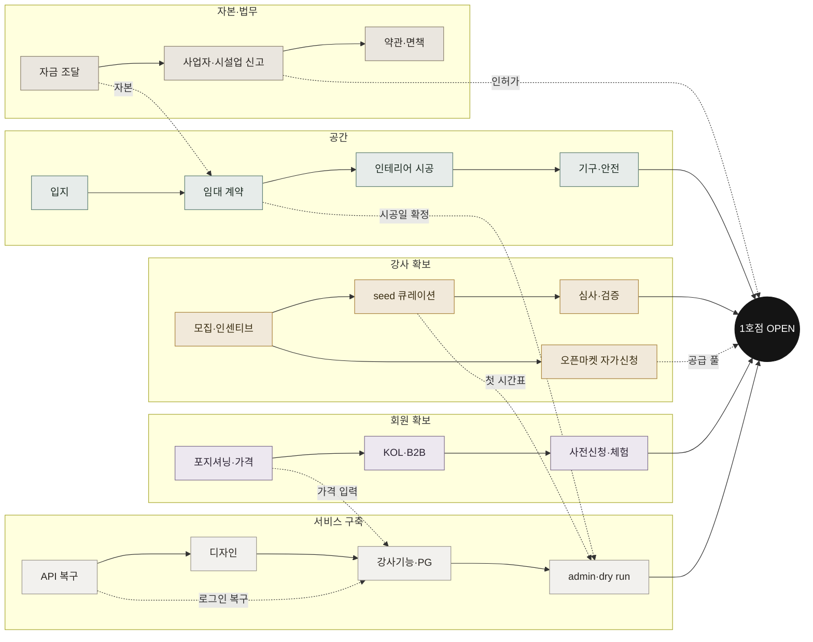

# 5I. 창업 테크트리 — 1호점 오픈까지 트랙 교차 로드맵

> 1호점 오픈을 위한 준비를 **6개 트랙**(자본·법무 / 공간 / 강사 확보 / 회원 확보 / 서비스 구축 / 오픈)으로 펼쳐, **몇 개월에 걸쳐 병렬로 흐르며 교차**하는 테크트리.
> 목표 **3개월**, 현실선 **4~5개월** (공간·행정이 critical path). 상세 일정·예산 = [5F 런칭 플랜](./launch-plan.html), 분담 = [5G R&R](./rnr.html).

## 타임라인 (주 단위 · 병렬 트랙)

```mermaid
gantt
    title recoverGX 1호점 창업 — 트랙별 타임라인 (목표 ~13주)
    dateFormat X
    axisFormat W%W

    section 자본·법무
    자금 조달                 :a1, 0, 4
    사업자·체육시설업 신고     :a2, 1, 5
    약관·면책 자문            :a3, 2, 4

    section 공간 (Critical Path)
    입지 선정                 :s1, 0, 3
    임대 계약                 :s2, after s1, 2
    인테리어 시공             :s3, after s2, 6
    기구 입고·안전 셋업        :s4, after s3, 2

    section 강사 확보
    모집 채널·인센티브         :m1, 3, 4
    seed 강사 큐레이션         :m2, 7, 3
    심사·검증(아카데미)        :m3, 9, 3
    오픈마켓 자가신청(병렬)     :m4, 5, 8

    section 회원 확보
    포지셔닝·가격 확정         :u1, 2, 3
    KOL·B2B 사전영업          :u2, 6, 5
    사전신청·체험 드롭인       :u3, 10, 3

    section 서비스 구축
    API 인프라 복구           :p1, 0, 2
    디자인 모노크롬 적용       :p2, 1, 5
    강사기능·결제 PG          :p3, 3, 5
    admin 셋업·dry run        :p4, 9, 3

    section 오픈
    1호점 OPEN               :milestone, open, 13, 0
```

## 트랙 교차 (의존성 트리)

실선 = 트랙 내 진행, **점선 = 트랙 간 선행조건**. 모든 트랙이 **◆ OPEN**으로 수렴.

## 트랙별 단계

| 트랙 | 단계 (왼→오) | 기간(대략) | 교차 |
|---|---|---|---|
| **자본·법무** | 자금 조달 → 사업자·체육시설업 신고 → 약관·면책 | ~6주 | 자금 → 임대 / 인허가 → 오픈 |
| **공간** ⏳ | 입지 → 임대 계약 → 인테리어 시공(4~6주) → 기구·안전 | ~13주 (**최장**) | 시공일 → dry run |
| **강사 확보** | 모집·인센티브 → seed 큐레이션 → 심사·검증 / 오픈마켓 자가신청(병렬) | ~10주 | seed → 첫 시간표, 심사·공급 → 오픈 |
| **회원 확보** | 포지셔닝·가격 → KOL·B2B → 사전신청·체험 | ~10주 | 가격 → 서비스 입력 |
| **서비스 구축** | API 복구 → 디자인 → 강사기능·PG → admin·dry run | ~11주 | 복구 → 전 기능, dry run → 오픈 |
| **오픈** | 1호점 OPEN → 운영·회고 | D-Day | 전 트랙 수렴 |

## 지금 위치 & 병목

- **서비스 구축은 대부분 완성** (DB·API·3앱·디자인·강사기능 코드 완료). 단 **API 인프라 복구(P1)가 막혀** 실사용·강사 라이브가 잠김 → 서비스 트랙의 첫 매듭.
- **공간 트랙이 전체 critical path** — 임대·인허가·시공이 가장 길고 다른 트랙을 기다리게 함. **여기부터 착수해야 3개월이 가능.**
- 강사·회원 트랙은 **공간과 병렬**로 일찍 시작 가능(모집·사전영업·포지셔닝).

---

| 2026-06-05 | 초안(소프트웨어 의존성) |
| 2026-06-05 | 창업 관점 전면 재작성 — 6트랙(자본·공간·강사·회원·서비스·오픈) 병렬 타임라인 + 교차 의존성 |
