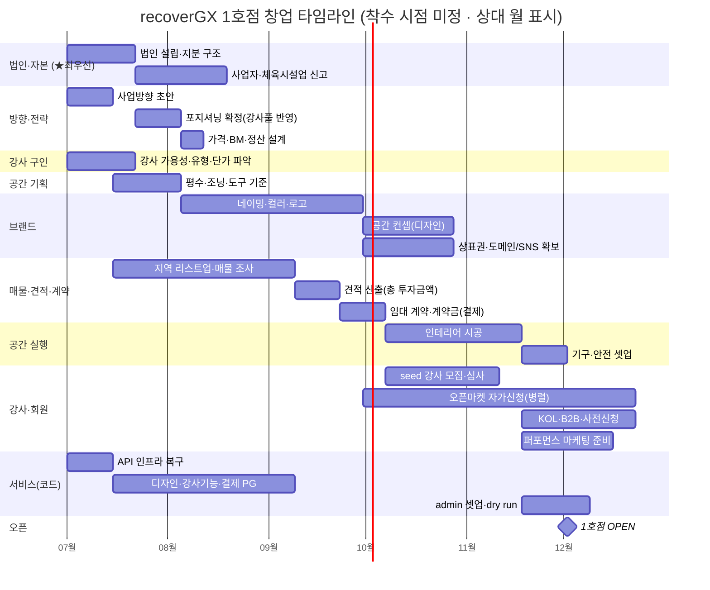
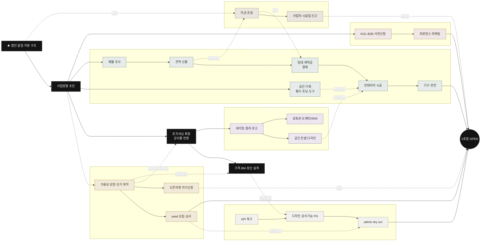

# 5I. 창업 테크트리 — 1호점 오픈까지 트랙 교차 로드맵

> 1호점 오픈 준비를 **트랙별로 펼쳐 병렬로 흐르며 교차**하는 테크트리.
> **디지털 서비스는 거의 완성**(코드)이라 빠르나, **오프라인 준비가 critical path**. 단 **브랜딩 ∥ 매물 조사는 동시 진행**(각 2~3개월, 합산 아님) → 준비 ~2~3개월 + 임대·시공 ~2개월 = **현실 ~4~5개월**(여유 6개월). 상세 일정·예산 = [5F 런칭 플랜](./launch-plan.html), 분담 = [5G R&R](./rnr.html).

{: .note }
> **병렬 원칙**: 법인·지분(★) 확정 후 → 브랜드·포지셔닝 · 매물 조사 · 강사/공간 기획 · 서비스 복구를 **동시에** 굴린다. 직렬로 쌓지 말 것.

## 타임라인 (주 단위 · 병렬 트랙)

## 트랙 교차 (의존성 트리)

실선 = 트랙 내 진행, **점선 = 트랙 간 선행조건**. 모든 트랙이 **◆ OPEN**으로 수렴.

## 실행 순서 (5 웨이브)

의존성·★우선순위·병렬성을 종합한 권장 순서. **웨이브 안의 항목은 동시 진행.**

| 웨이브 | 시점 | 동시 착수 | 이유 |
|---|---|---|---|
| **0. 지금** | M1 | ★ **법인·지분 구조** · **사업방향 초안 + 강사 가용성·유형·단가 파악**(동시) · **API 인프라 복구** | 법인은 출자·계약·상표·임대 주체(절대 1번). **포지셔닝 확정 전에 "어떤 강사를 데려올 수 있는가"를 먼저 파악** — 강사풀이 컨셉·타깃·가격을 좌우. API 복구는 코드 독립 → 지금 |
| **1. 강사풀 파악 후** | M2~ | **포지셔닝 확정(강사풀 반영) → 가격·BM·정산** · **브랜드(네이밍·로고) ∥ 매물 조사**(각 2~3개월) · 공간 기획 | 포지셔닝은 강사 가용성을 입력받아 확정 → 그 위에 네이밍·가격. 브랜딩·매물이 제일 길어 동시 착수 |
| **2. 네이밍 확정 즉시** | M2~ | **상표권 출원 · 도메인/SNS 선점** · 공간 컨셉 디자인 | 상표·핸들은 선점 경쟁 → 이름 나오면 바로. 공간 컨셉은 시공 도면 입력 |
| **3. 매물 확정 후** | M3~ | **견적 산출 → 임대·계약금(결제) → 인테리어 시공(4~6주)** · (병행) seed 강사 **확보·심사** · 마케팅 준비 | **시공은 매물 견적 내고 결제(계약금) 후 착수.** 강사 확보(계약)는 오픈 가까이, 시공과 병행 |
| **4. 시공 막바지** | M5~ | 기구·안전 셋업 · admin 셋업·dry run · 사전신청·체험 | 공간 완성 + 시간표 배치 + 첫 수요 |
| **5. OPEN** | ~M5–6 | 1호점 오픈 → 24h 회고 | 전 트랙 수렴 |

> **가장 흔한 실수 = 직렬로 쌓기.** 법인만 먼저, 그 다음은 브랜딩·매물·강사·서비스를 **동시에** 굴려야 4~5개월이 가능. 순차로 하면 8개월+.
> **강사는 "파악(검증)은 미리(M1), 확보(계약)는 오픈 직전(M3~)"** — 오픈일 없이 일찍 계약하면 이탈. 미리 할 건 수요·단가 검증 + `/apply` 대기 풀.

## 창업 사전 준비 상세 (협업자 초안 반영)

> 아래는 **다른 협업자가 작성한 사전 준비표**를 반영한 것. 위 테크트리의 강사·공간·브랜딩·매물·견적 트랙의 근거.

| 구분 | 상세 업무 | 사전 준비 / 선행 조건 | 예상 기간 | 착수 시기 |
|---|---|---|---|---|
| **강사 구인** | 1. 강사 수요 파악(구인 난이도) · 2. 강사 단가 파악 | 운영할 그룹수업 방향성 확정 / [기준: 일반·인플루언서] 회당 강사료·고정급·인센티브·매출쉐어 비교 | 2~3주 | 콘텐츠 방향성 확정되면 바로 |
| **공간 기획** | 1. 평수 기준 · 2. 조닝 구성 · 3. 필요 도구 | 예상 정원·필요 평수·수업존/대기존/탈의존/수납존 기준 + 도구·장비 확인 | 2~3주 | 콘텐츠·컨셉·기획 후 |
| **브랜딩** | 1. 네이밍 · 2. 브랜드 컬러 · 3. 로고 · 4. 공간 컨셉(디자인) | 타깃 고객·가격대·수업 방향·공간 분위기 먼저 정리 | 2~3개월 | 사업 방향 확정 후 |
| **매물 조사** | 1. 지역 리스트업 · 2. 부동산 매물 조사 | 후보 지역·상권·접근성·보증금·월세·평수·주차·층수 | 2~3개월 | 브랜딩 착수와 함께 |
| **견적 산출** | 총 투자금액 산출 | 보증금·권리금·인테리어·장비·집기·마케팅비·인건비 | 2주 | 브랜딩 착수와 함께 |

## Founder 6대 과제 (우선순위)

> 창업 관점의 최상위 과제. 위 테크트리 트랙과 매핑.

| # | 과제 | 테크트리 트랙 | 상태 |
|---|---|---|---|
| 1 | **법인 생성 및 지분 구조** ★가장 중요 | 법인·자본 (루트) | 🔴 미착수 — 모든 것의 선행, 가장 먼저 |
| 2 | 매물 알아보기 (1호점) | 매물·견적 → 공간 실행 | 🔴 (브랜딩과 병행, 2~3개월) |
| 3 | 앱(Platform) 개발 및 기획 | 서비스(코드) | 🟡 거의 완성 — API 인프라 복구만 남음 |
| 4 | 브랜드 만들기 (이름·로고) | 브랜드·포지셔닝 | 🔴 (포지셔닝 → 네이밍·로고·공간컨셉) |
| 5 | 상표권 및 디지털 영토 확보 | 브랜드·포지셔닝 | 🔴 (네이밍 확정 후 상표 출원·도메인·SNS) |
| 6 | 퍼포먼스 마케팅 준비 | 회원 | 🔴 (광고 계정·픽셀·소재, 오픈 전) |

**★ 1번(법인·지분)이 절대 최우선** — 출자·계약·상표·임대 전부 법인 주체가 있어야 진행. 여기부터.

## 논의사항 (미해결)

- **콘텐츠 기획을 어떻게 할 것인지** — 모든 트랙(강사·공간·브랜딩)의 뿌리. 먼저 확정 필요.
- **강사 제안형 운영 시**: 수업 제안서 · 테스트 클래스 · 정규 편성 기준 마련 필요.
- (서비스 측) recoverGX 디지털 브랜드는 모노크롬으로 확정됐으나, 위 **오프라인 브랜딩(네이밍·로고·공간 컨셉)과 정합** 필요.

## 지금 위치 & 병목

- **서비스(코드)는 거의 완성** — DB·API·3앱·디자인·강사기능. 단 **API 인프라 복구(P1)가 첫 매듭**(현재 로그인 불가).
- **오프라인이 전체 critical path** — 특히 **브랜딩·매물(각 2~3개월)** 이 길어 여기서 일정이 결정됨. **콘텐츠·사업방향 확정 → 브랜딩·매물 동시 착수**가 시작점.

---

| 2026-06-05 | 초안(소프트웨어 의존성) |
| 2026-06-05 | 창업 관점 6트랙 재작성 |
| 2026-06-05 | 협업자 사전 준비표(강사구인·공간기획·브랜딩·매물·견적) 반영 — 브랜딩·매물 2~3개월 lead 포함, 타임라인 ~5~6개월로 갱신 |
| 2026-06-05 | Founder 6대 과제(법인·지분★·매물·앱·브랜드·상표권/디지털영토·퍼포먼스) + 브랜드·포지셔닝 트랙 분리 반영 |
| 2026-06-05 | 실행 순서(5웨이브) 추가 · 포지셔닝→방향(M1) 이동 · 가격·BM·정산 설계 추가 · 시공=매물→견적→결제→시공 체인 · gantt 축 월 단위 정리 · 강사는 검증(미리)/확보(오픈직전) 구분 |
| 2026-06-05 | 강사 가용성·유형 파악 → 포지셔닝 확정 의존성 반영 (강사풀이 컨셉·타깃·가격 좌우, 강사 파악을 방향과 동시 착수) |
