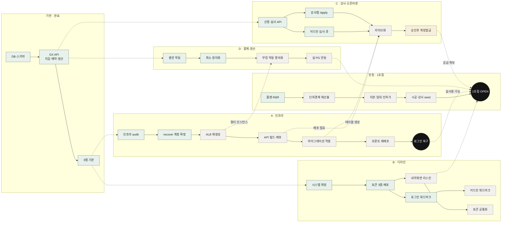
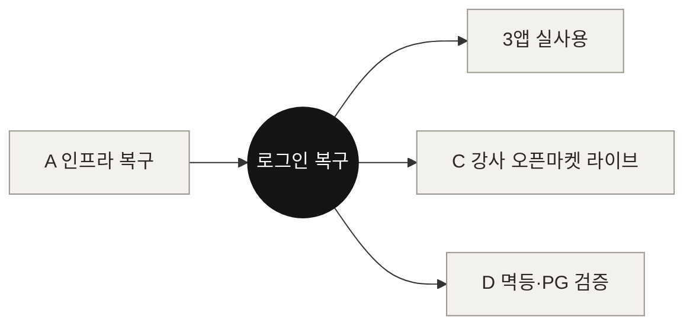

# 5I. 테크트리 — 트랙 교차 의존성 맵

> 해야 할 일을 **트랙(레인)별로 펼치고, 트랙 사이를 잇는 의존성**으로 그린 테크트리.
> 실선 = 같은 트랙 진행, **점선 = 다른 트랙과 교차(선행조건)**. ◆ = 목표(게이트).
> 항목 상세·체크박스는 [5H 백로그](./backlog.html). 기준일 2026-06-05.

## 읽는 법

- **세로 = 트랙**(인프라 A · 강사 C · 디자인 B · 결제 D · 런칭). 각 트랙은 왼→오 순서로 진행.
- **점선 = 교차 선행조건.** 예: 강사 오픈마켓(C)은 다 만들어졌지만 **라이브(C4)는 인프라의 배포(A4)·마이그레이션(A5)이 끝나야** 켜진다.
- **◆ 게이트 2개**: `로그인 복구`(A 트랙 끝) · `1호점 OPEN`(거의 모든 트랙 수렴).

## 지금의 병목

> **A(인프라)가 최대 병목.** ALB 삭제로 로그인이 죽었고, 그 때문에 ① 모든 앱 실사용 ② 강사 오픈마켓(C) 라이브 ③ 결제 멱등(D3)이 전부 막혀 있다. **A를 풀면 C가 즉시 따라 켜진다.**

## 트랙 요약

| 트랙 | 완료 | 진행/대기 | 게이트·교차 |
|---|---|---|---|
| **기반** | DB·GX API·3앱 | — | 모든 트랙의 뿌리 |
| **A 인프라** | audit·계정확정 | ALB·배포·마이그레이션·재배포 | → 로그인 복구 (C·D·런칭 잠금 해제) |
| **C 강사 오픈마켓** | API·심사 큐·/apply | 라이브화·계정발급 | ← A4·A5 (배포·테이블) |
| **B 디자인** | 시스템·토큰·로그인 | 어드민 워드마크·내부화면·공통화 | → 런칭(완성도) |
| **D 결제** | 충전 멱등·취소 원자화 | 부킹 멱등 영속화·실 PG | ← A(멀티 인스턴스) |
| **런칭** | 플랜·R&R | 단위경제·자본·시공·OPEN | ← A·B·C·D 수렴 |

---

| 2026-06-05 | 초안 — 트랙 교차 의존성 테크트리(mermaid) + 병목(A) 분석 |
