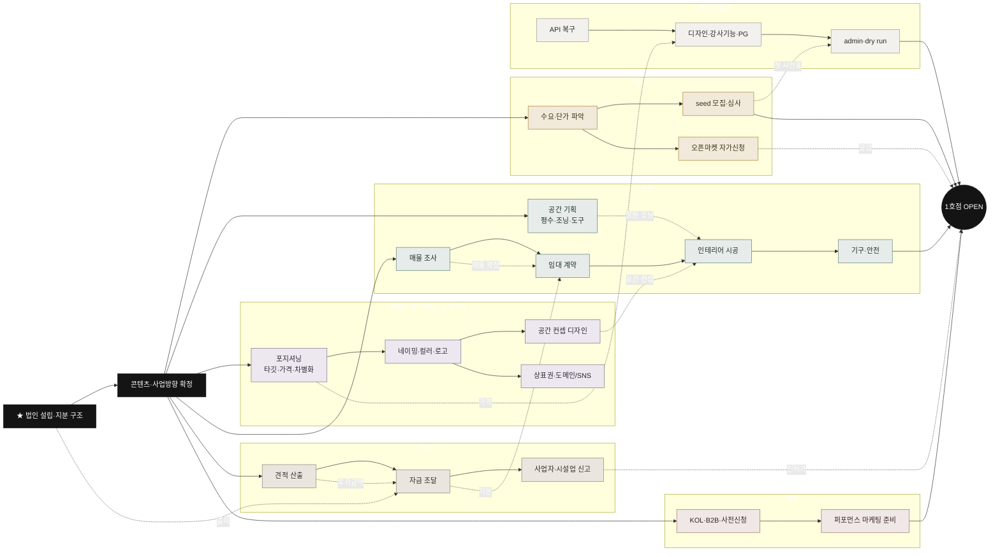

# 5I. 창업 테크트리 — 1호점 오픈까지 트랙 교차 로드맵

> 1호점 오픈 준비를 **트랙별로 펼쳐 병렬로 흐르며 교차**하는 테크트리.
> **디지털 서비스는 거의 완성**(코드)이라 빠르나, **오프라인 준비(브랜딩 2~3개월·매물 2~3개월·시공 1.5개월)가 critical path** → 현실 타임라인 **~5~6개월**. 상세 일정·예산 = [5F 런칭 플랜](./launch-plan.html), 분담 = [5G R&R](./rnr.html).

## 타임라인 (주 단위 · 병렬 트랙)

```mermaid
gantt
    title recoverGX 1호점 창업 — 트랙 타임라인 (오프라인 기준 ~5~6개월)
    dateFormat X
    axisFormat W%W

    section 법인·자본 (★최우선)
    법인 설립·지분 구조         :c0, 0, 3
    사업자·체육시설업 신고       :c1, 3, 4

    section 방향 확정
    콘텐츠·사업방향 확정        :d0, 0, 2

    section 강사 구인
    강사 수요 파악             :m1, 2, 2
    강사 단가 파악(쉐어 비교)   :m2, 2, 3

    section 공간 기획
    평수·조닝·도구 기준         :g1, 2, 3

    section 브랜드·포지셔닝
    포지셔닝(타깃·가격·차별화)   :b0, 2, 3
    네이밍·컬러·로고            :b1, 4, 7
    공간 컨셉(디자인)           :b2, 8, 6
    상표권·도메인/SNS 확보       :b3, 8, 5

    section 매물·견적
    지역 리스트업·매물 조사      :r1, 2, 10
    견적 산출(총 투자금액)       :r2, 2, 2

    section 공간 실행
    임대 계약                  :s1, after r1, 2
    인테리어 시공              :s2, after s1, 6
    기구·안전 셋업             :s3, after s2, 2

    section 강사·회원
    seed 강사 모집·심사         :m3, 14, 5
    오픈마켓 자가신청(병렬)      :m4, 12, 10
    KOL·B2B·사전신청           :u1, 16, 7
    퍼포먼스 마케팅 준비         :u2, 18, 6

    section 서비스(코드)
    API 인프라 복구            :p1, 0, 2
    디자인·강사기능·결제 PG     :p2, 2, 8
    admin 셋업·dry run         :p3, 20, 3

    section 오픈
    1호점 OPEN                :milestone, open, 24, 0
```

## 트랙 교차 (의존성 트리)

실선 = 트랙 내 진행, **점선 = 트랙 간 선행조건**. 모든 트랙이 **◆ OPEN**으로 수렴.

## 창업 사전 준비 상세 (협업자 초안 반영)

> 아래는 **다른 협업자가 작성한 사전 준비표**를 반영한 것. 위 테크트리의 강사·공간·브랜딩·매물·견적 트랙의 근거.

| 구분 | 상세 업무 | 사전 준비 / 선행 조건 | 예상 기간 | 착수 시기 |
|---|---|---|---|---|
| **강사 구인** | 1. 강사 수요 파악(구인 난이도) · 2. 강사 단가 파악 | 운영할 그룹수업 방향성 확정 / [기준: 일반·인플루언서] 회당 강사료·고정급·인센티브·매출쉐어 비교 | 2~3주 | 콘텐츠 방향성 확정되면 바로 |
| **공간 기획** | 1. 평수 기준 · 2. 조닝 구성 · 3. 필요 도구 | 예상 정원·필요 평수·수업존/대기존/탈의존/수납존 기준 + 도구·장비 확인 | 2~3주 | 콘텐츠·컨셉·기획 후 |
| **브랜딩** | 1. 네이밍 · 2. 브랜드 컬러 · 3. 로고 · 4. 공간 컨셉(디자인) | 타깃 고객·가격대·수업 방향·공간 분위기 먼저 정리 | 2~3개월 | 사업 방향 확정 후 |
| **매물 조사** | 1. 지역 리스트업 · 2. 부동산 매물 조사 | 후보 지역·상권·접근성·보증금·월세·평수·주차·층수 | 2~3개월 | 브랜딩 착수와 함께 |
| **견적 산출** | 총 투자금액 산출 | 보증금·권리금·인테리어·장비·집기·마케팅비·인건비 | 2주 | 브랜딩 착수와 함께 |

## Founder 6대 과제 (우선순위)

> 창업 관점의 최상위 과제. 위 테크트리 트랙과 매핑.

| # | 과제 | 테크트리 트랙 | 상태 |
|---|---|---|---|
| 1 | **법인 생성 및 지분 구조** ★가장 중요 | 법인·자본 (루트) | 🔴 미착수 — 모든 것의 선행, 가장 먼저 |
| 2 | 매물 알아보기 (1호점) | 매물·견적 → 공간 실행 | 🔴 (브랜딩과 병행, 2~3개월) |
| 3 | 앱(Platform) 개발 및 기획 | 서비스(코드) | 🟡 거의 완성 — API 인프라 복구만 남음 |
| 4 | 브랜드 만들기 (이름·로고) | 브랜드·포지셔닝 | 🔴 (포지셔닝 → 네이밍·로고·공간컨셉) |
| 5 | 상표권 및 디지털 영토 확보 | 브랜드·포지셔닝 | 🔴 (네이밍 확정 후 상표 출원·도메인·SNS) |
| 6 | 퍼포먼스 마케팅 준비 | 회원 | 🔴 (광고 계정·픽셀·소재, 오픈 전) |

**★ 1번(법인·지분)이 절대 최우선** — 출자·계약·상표·임대 전부 법인 주체가 있어야 진행. 여기부터.

## 논의사항 (미해결)

- **콘텐츠 기획을 어떻게 할 것인지** — 모든 트랙(강사·공간·브랜딩)의 뿌리. 먼저 확정 필요.
- **강사 제안형 운영 시**: 수업 제안서 · 테스트 클래스 · 정규 편성 기준 마련 필요.
- (서비스 측) recoverGX 디지털 브랜드는 모노크롬으로 확정됐으나, 위 **오프라인 브랜딩(네이밍·로고·공간 컨셉)과 정합** 필요.

## 지금 위치 & 병목

- **서비스(코드)는 거의 완성** — DB·API·3앱·디자인·강사기능. 단 **API 인프라 복구(P1)가 첫 매듭**(현재 로그인 불가).
- **오프라인이 전체 critical path** — 특히 **브랜딩·매물(각 2~3개월)** 이 길어 여기서 일정이 결정됨. **콘텐츠·사업방향 확정 → 브랜딩·매물 동시 착수**가 시작점.

---

| 2026-06-05 | 초안(소프트웨어 의존성) |
| 2026-06-05 | 창업 관점 6트랙 재작성 |
| 2026-06-05 | 협업자 사전 준비표(강사구인·공간기획·브랜딩·매물·견적) 반영 — 브랜딩·매물 2~3개월 lead 포함, 타임라인 ~5~6개월로 갱신 |
| 2026-06-05 | Founder 6대 과제(법인·지분★·매물·앱·브랜드·상표권/디지털영토·퍼포먼스) + 브랜드·포지셔닝 트랙 분리 반영 |
