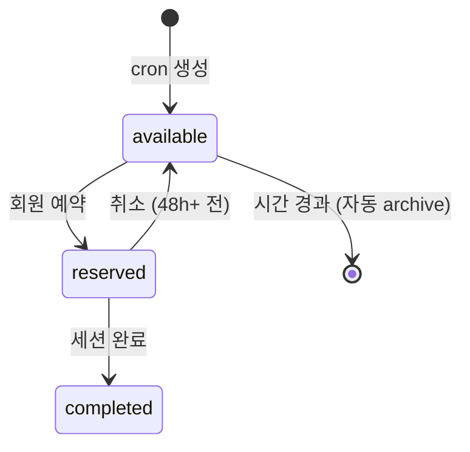
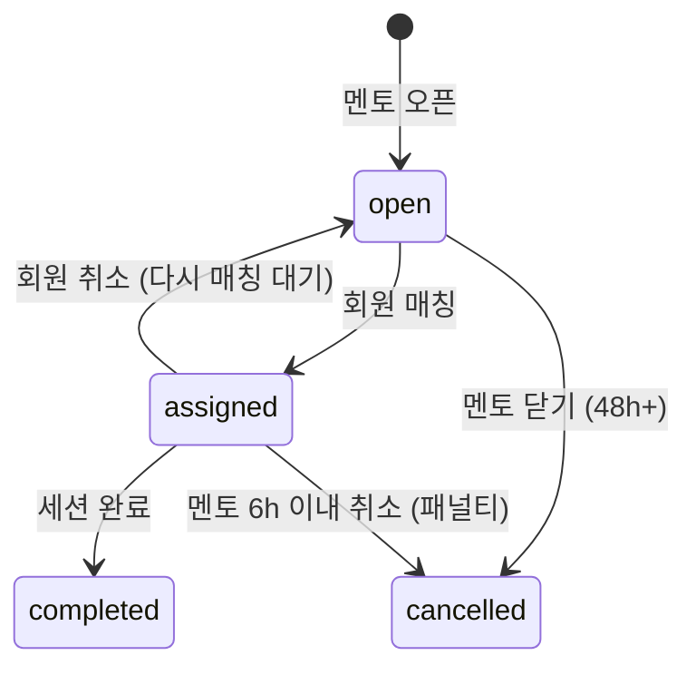
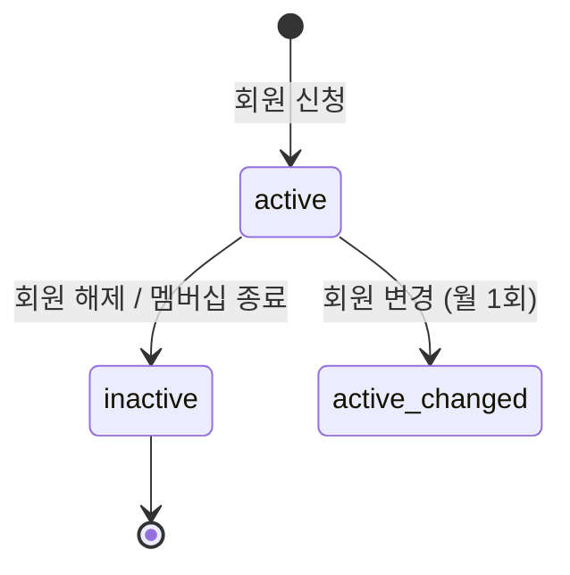

# 3. Schedule — RoomSlot·CardioSlot·MentorBlock·FixedSlot

슬롯 스케줄링 시스템. [4B 세션 포맷](../../service/session.html), [5A 예약](../../operations/reservation.html) 정책 반영.

## RoomSlot

**Purpose**: 방 60분 단위 슬롯. 30분 stagger (정각 4방 + 30분 4방).
**Related PRDs**: [🏢 예약 시스템](../platform/2026-05-13-reservation-system.html) · [🏢 세션 시스템](../platform/2026-05-13-session-system.html)
**Lifecycle**: cron 생성 → available → reserved → completed

### Fields

| Field | Type | Required | Default | Description |
|---|---|---|---|---|
| id | String | ✓ | cuid() | PK |
| roomId | String | ✓ | - | FK → Room |
| storeId | String | ✓ | - | FK → Store (denorm) |
| startAt | DateTime | ✓ | - | 60분 슬롯 시작 (정각/30분) |
| status | SlotStatus | ✓ | available | available/reserved/completed |
| reservedByMemberId | String? | - | null | 예약 잡힌 회원 |

### Validation
- (roomId, startAt) unique
- startAt 분 = 0 또는 30 (stagger 강제)
- startAt > now (과거 슬롯 신규 생성 ❌)

### State Transitions

### Indexes
- `[roomId, startAt]` (unique)
- `[startAt, status]` — 가용 슬롯 조회

### Common Queries
- 가용 슬롯: `WHERE status='available' AND startAt > NOW()`
- 회원 다음 예약: `WHERE reservedByMemberId=? AND startAt > NOW() ORDER BY startAt`

### Edge Cases
- 방 maintenance 전환 시 → 미래 available 슬롯 자동 cancel
- 슬롯 생성 cron: 매일 자정에 14일 후 슬롯 추가

---

## CardioSlot

**Purpose**: 카디오 자리 30분 단위 슬롯.
**Related PRDs**: 같음
**Lifecycle**: 동일 (available → reserved → completed)

### Fields

| Field | Type | Required | Default | Description |
|---|---|---|---|---|
| id | String | ✓ | cuid() | PK |
| seatId | String | ✓ | - | FK → CardioSeat |
| storeId | String | ✓ | - | FK (denorm) |
| startAt | DateTime | ✓ | - | 30분 슬롯 시작 |
| status | SlotStatus | ✓ | available | |
| reservedByMemberId | String? | - | null | |

### Validation
- (seatId, startAt) unique
- 분 = 0 또는 30
- RoomSlot.startAt = CardioSlot.startAt + 30분 (회원 예약 시 연속 점유 필수)

### Indexes
- `[seatId, startAt]` (unique)
- `[startAt, status]` — 가용 카디오 자리 조회

### Common Queries
- 특정 시각 카디오 자리 가용 수: `COUNT WHERE startAt=? AND status='available'`

### Edge Cases
- 카디오 기계 고장 (CardioSeat.status=maintenance): 그 자리 미래 슬롯 자동 cancel
- 카디오 부족 시 (6 자리 만석): 회원 예약 자동 매칭 시 거절

---

## MentorBlock

**Purpose**: 멘토가 직접 오픈하는 30분 단위 가능 시간. 1시간 = 2 블록 = 2 회원 cover.
**Related PRDs**: [💪 슬롯 오픈](../mentor/2026-05-13-reservation.html) · [🏢 예약 시스템](../platform/2026-05-13-reservation-system.html)
**Lifecycle**: 멘토 open → assigned → completed (또는 cancelled)

### Fields

| Field | Type | Required | Default | Description |
|---|---|---|---|---|
| id | String | ✓ | cuid() | PK |
| mentorId | String | ✓ | - | FK |
| startAt | DateTime | ✓ | - | 30분 단위 |
| status | BlockStatus | ✓ | open | open/assigned/completed/cancelled |
| assignedSessionId | String? | - | null | 매칭된 Session |
| assignedAt | DateTime? | - | null | |
| cancelledAt | DateTime? | - | null | |
| cancellationReason | String? | - | null | |
| penaltyApplied | Boolean | ✓ | false | 6h 이내 취소 시 true |

### Validation
- (mentorId, startAt) unique
- 분 = 0 또는 30
- 취소 시 cancelledAt 기록 의무
- 6h 이내 취소 = penaltyApplied=true 강제

### State Transitions

### Indexes
- `[mentorId, startAt]` (unique)
- `[startAt, status]` — 매칭 시 가능한 블록 검색 (status=open)
- `[mentorId, status]` — 멘토 일정 조회

### Common Queries
- 매칭 가능 블록: `WHERE status='open' AND startAt > NOW() + 1h` (당일 임박 매칭은 별도)
- 멘토 이번 격주 매칭 수: `WHERE mentorId=? AND status='completed' AND startAt BETWEEN ?`

### Edge Cases
- 동일 시각 두 블록 (1시간 stagger cover) 동시 매칭 시도 → 시스템이 동시 할당
- 멘토 노쇼 (T+15 미체크인): status=completed → 정산에서 차감 + 회원 보상
- 멘토 6h 이내 취소: penaltyApplied=true → MentorPayout 차감 + 회원 보상

---

## FixedSlot

**Purpose**: 회원의 매주 고정 슬롯 (피크 6-10pm). 매주 자동 예약.
**Related PRDs**: [👤 예약](../user/2026-05-13-reservation.html) · [💪 슬롯](../mentor/2026-05-13-reservation.html) · [🏢 예약 시스템](../platform/2026-05-13-reservation-system.html)
**Lifecycle**: 회원 설정 → 매주 자동 매칭 → (선택) 변경 / 해제

### Fields

| Field | Type | Required | Default | Description |
|---|---|---|---|---|
| id | String | ✓ | cuid() | PK |
| memberId | String | ✓ | - | FK |
| weekday | Int | ✓ | - | 0-6 (월~일) |
| hour | Int | ✓ | - | 6-22 (운영 시간 내) |
| minute | Int | ✓ | - | 0 또는 30 |
| active | Boolean | ✓ | true | |
| lastMentorId | String? | - | null | 이전 멘토 (우선 매칭) |
| createdAt | DateTime | ✓ | now() | |
| lastChangedAt | DateTime? | - | null | 월 1회 변경 제한 |

### Validation
- (memberId, weekday, hour, minute) unique (한 회원 = 1 슬롯)
- minute = 0 또는 30
- 피크 시간만 (hour 18-22) — Phase 1 가설
- 변경 = 월 1회 제한 (lastChangedAt + 30일 후 가능)

### State Transitions

### Indexes
- `[memberId, weekday, hour, minute]` (unique)
- `[active]` — cron 매주 자동 예약 시 활성 슬롯 조회

### Common Queries
- 활성 고정 슬롯: `WHERE active = true`
- 다음 주 자동 예약 대상: `WHERE active=true AND ... cron job`

### Edge Cases
- 이전 멘토(lastMentorId) 다음 주 슬롯 안 오픈 → AI 다른 멘토 매칭 + 회원 알림
- 회원 일시정지 → active=false (재개 시 true)
- 멤버십 만료 → active=false 자동 전환
- 동일 시각 다른 회원의 고정 슬롯과 충돌 시 — 방 8개 stagger 운영으로 동시 가능 (방 매칭 알고리즘이 처리)

## 📘 사용 PRD

[👤 세션 진행](../user/2026-05-13-session-flow.html) · [👤 예약](../user/2026-05-13-reservation.html) · [💪 세션 진행](../mentor/2026-05-13-session-flow.html) · [💪 슬롯](../mentor/2026-05-13-reservation.html) · [🏢 세션 시스템](../platform/2026-05-13-session-system.html) · [🏢 예약 시스템](../platform/2026-05-13-reservation-system.html)

---

| 2026-05-13 | 초안 — Schedule 4 모델 상세 명세 |
