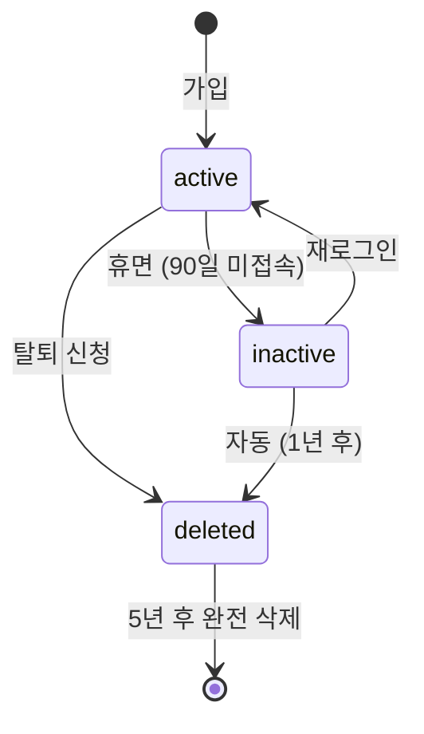
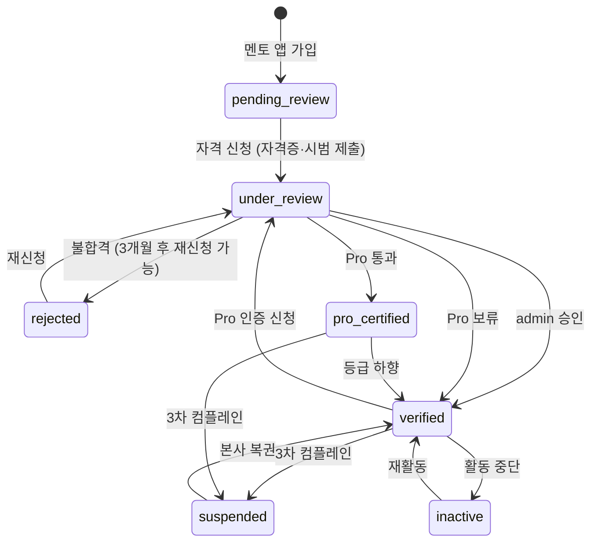

# 1. Identity — Member·Mentor·Admin

회원·멘토·관리자 3 종 식별 주체.

## Member

**Purpose**: 회원 (PT 서비스 사용자). 페르소나 정보·멤버십·포인트·예약·결제·평가 보유.
**Related PRDs**: [👤 모든 회원 PRD](../user/) · [🏢 멤버십 시스템](../platform/2026-05-13-membership-system.html)
**Lifecycle**: 가입 → 활동 → 일시정지·이탈 → 삭제 (개인정보 보관 5년)

### Fields

| Field | Type | Required | Default | Description |
|---|---|---|---|---|
| id | String | ✓ | cuid() | PK |
| email | String | ✓ | - | 로그인 ID, unique |
| phone | String | ✓ | - | 010-XXXX-XXXX, unique |
| passwordHash | String | ✓ | - | bcrypt |
| name | String | ✓ | - | 실명 |
| avatarUrl | String? | - | null | 프로필 사진 |
| ageRange | String? | - | null | "20-30" 등 (가입 시 페르소나) |
| experience | String? | - | null | "신규" / "재개" / "중급" |
| goals | String[] | - | [] | ["체형 관리", "체력"] |
| weeklyTarget | Int? | - | null | 주 N회 목표 (1A 페르소나) |
| createdAt | DateTime | ✓ | now() | |
| status | MemberStatus | ✓ | active | active/inactive/deleted |

### Validation
- email: RFC 5322 format
- phone: 한국 형식 (10-11자리)
- name: 2자 이상, 한글·영문·공백
- ageRange: enum ["10-20", "20-30", "30-40", "40-50", "50+"]
- experience: enum 위 3종

### State Transitions



### Indexes
- `email` (unique)
- `phone` (unique)
- `status` — 활성 회원 카운트
- `createdAt` — 가입 분석

### Common Queries
- 현재 활성 회원: `WHERE status = 'active'`
- 멤버십 + 회원: `Member JOIN Membership ON memberId WHERE Membership.status = 'active'`
- 페르소나 분포: `GROUP BY ageRange, experience, weeklyTarget`

### Edge Cases
- 동일 이메일 재가입: deleted 상태에서만 가능 (5년 후 hard delete)
- 이메일 변경: 인증 메일 (별도 EmailChange 모델 고려)
- 전화번호 중복 (다른 회원): 본인 인증으로 양도 / 차단

---

## Mentor

**Purpose**: 멘토 (강사). 슬롯 오픈·세션 진행·정산·등급 보유.
**Related PRDs**: [💪 모든 멘토 PRD](../mentor/) · [🏢 멘토 등급 시스템](../platform/2026-05-13-mentor-tier-system.html)

### 가입·승인 흐름

> **별도 모집 페이지 ❌**. 멘토 앱 다운로드 → 가입 → 그 안에서 자격 신청. admin이 승인.

```
[멘토 앱 다운로드·가입] → tier='pending_review', status='active'
       ↓ 멘토 앱 안에서 자격 신청 (자격증·경력·시범 영상 등 제출)
[under_review] → admin 검토
       ↓ 검증 코스 통과 + admin 승인
[verified] → 활동 시작 (슬롯 오픈 가능)
       ↓ Pro 인증 신청 (자격 충족 시)
[pro_certified] → 단가 자율 권한
       ↓ (옵션) 컴플레인 누적 / 활동 중단 등
[suspended / inactive / rejected]
```

### Fields

| Field | Type | Required | Default | Description |
|---|---|---|---|---|
| id | String | ✓ | cuid() | PK |
| email | String | ✓ | - | unique |
| phone | String | ✓ | - | unique |
| passwordHash | String | ✓ | - | bcrypt |
| name | String | ✓ | - | 실명 |
| avatarUrl | String? | - | null | |
| tier | MentorTier | ✓ | pending_review | pending_review / under_review / verified / pro_certified / rejected |
| licenseNumber | String? | - | null | 자격증 번호 (Pro 필수) |
| licenseType | String? | - | null | "생활스포츠지도사 2급" 등 |
| licenseVerified | Boolean | ✓ | false | 본사 발행처 확인 |
| sessionCount | Int | ✓ | 0 | 누적 세션 수 |
| averageRating | Decimal(2,1)? | - | null | 회원 평점 평균 |
| rebookRate | Decimal(3,2)? | - | null | 재예약률 0-1 |
| attendanceRate | Decimal(3,2)? | - | null | 출석률 0-1 |
| recordQualityScore | Decimal(3,2)? | - | null | AI 산출 |
| proMinRate | Int? | - | null | Pro 단가 하한 (본사 결정) |
| proMaxRate | Int? | - | null | Pro 단가 상한 |
| proCurrentRate | Int? | - | null | Pro 현재 단가 (자율) |
| verifiedAt | DateTime? | - | null | 검증 코스 통과 |
| proCertifiedAt | DateTime? | - | null | Pro 인증 |
| status | MentorStatus | ✓ | active | active/suspended/inactive |
| createdAt | DateTime | ✓ | now() | |

### Validation
- 일반 멘토: proCurrentRate 설정 불가
- Pro 멘토: proMinRate ≤ proCurrentRate ≤ proMaxRate
- tier=pro_certified 시 licenseVerified=true 필수

### State Transitions



### Indexes
- `email`, `phone` (unique)
- `tier, status` — 매칭 시 활성 멘토 필터
- `averageRating` — Pro 자격 체크

### Constraints
- proCurrentRate 변경 시 → `MentorRateChange` 기록 의무
- tier 변경 시 → `TierChange` 기록 의무

### Common Queries
- 매칭 가능 멘토: `WHERE status = 'active' AND tier IN ('verified', 'pro_certified')`
- Pro 자격 충족: `WHERE sessionCount >= 100 AND averageRating >= 4.3 AND rebookRate >= 0.6`
- 평점 상위: `ORDER BY averageRating DESC, sessionCount DESC`

### Edge Cases
- 자격증 만료: licenseVerified → false로 자동 변경 (cron)
- Pro 단가 너무 높아 매칭 0: 7일+ 매칭 없으면 본사 알림
- 멘토 활동 중 자격 정지: 진행 중 예약은 다른 멘토로 자동 재매칭

---

## Admin

**Purpose**: 본사 운영자. 검증·심사·컴플레인·정산 처리.
**Related PRDs**: [🏢 모든 플랫폼 PRD](../platform/)
**Lifecycle**: 채용 → 활동 → 퇴사 (계정 정지)

### Fields

| Field | Type | Required | Default | Description |
|---|---|---|---|---|
| id | String | ✓ | cuid() | PK |
| email | String | ✓ | - | unique |
| passwordHash | String | ✓ | - | |
| name | String | ✓ | - | |
| role | String | ✓ | operator | operator/finance/super |
| status | String | ✓ | active | active/suspended |
| createdAt | DateTime | ✓ | now() | |
| lastLoginAt | DateTime? | - | null | |

### Validation
- role enum 강제
- super role = 1명만 가능 (제약 추가)

### Common Queries
- 결정 이력 추적: `JOIN TierChange ON changedBy = Admin.id`
- 활동 모니터링: `WHERE lastLoginAt > NOW() - 30days`

## 📘 사용 PRD

[👤 모든 회원 PRD](../user/) · [💪 모든 멘토 PRD](../mentor/) · [🏢 멤버십 시스템](../platform/2026-05-13-membership-system.html) · [🏢 멘토 등급](../platform/2026-05-13-mentor-tier-system.html)

---

| 2026-05-13 | 초안 — Member/Mentor/Admin 상세 명세 |
