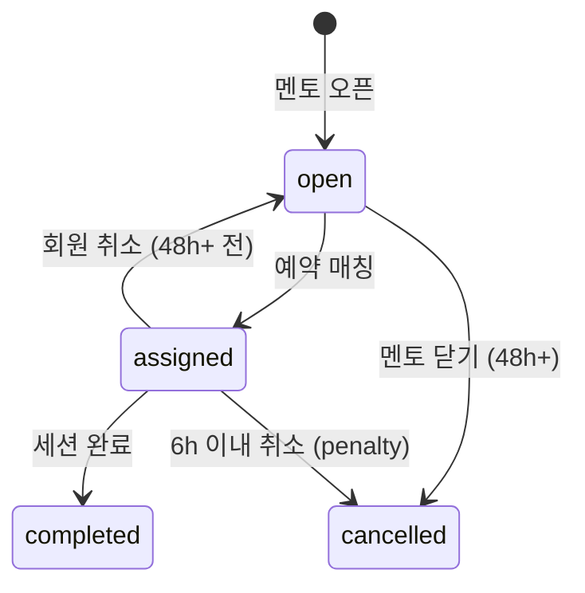

# 3. Schedule — MentorBlock · FixedSlot (v2)

**Status**: v2 Accepted · **Updated**: 2026-05-16 · **Source of truth**
**관련 결정**: [ADR 0001](../../decisions/0001-consumer-pivot.html) · [ADR 0003](../../decisions/0003-free-gym-add-on.html)
**의존**: [5A 예약](../../operations/reservation.html) · [5D 자유 헬스](../../operations/free-gym.html) · [2D 정책](../../members/policies.html)

> **v2 변경 요약**: `CardioSlot` · `RoomSlot` 모델은 폐기. 룸은 `Room` 마스터로만 존재하며 **점유는 강사 30분 unit 슬롯(`MentorBlock`)** 에서 파생된다. 룸이 필요한 프로그램이면 예약 트랜잭션이 자동으로 룸을 배정. 회원 1예약 = **강사 + 프로그램 + 30분 unit**(60분=2 unit 연속).

## 폐기 모델 (v1)

| v1 모델 | v2 처리 |
|---|---|
| `RoomSlot` (60분, stagger 4+4) | 폐기 — 룸은 강사 슬롯 점유에서 자동 배정 |
| `CardioSlot` (30분 단위) | 폐기 — "카디오 30 + 룸 60" 90분 세트 모델 폐기 |
| `FixedSlot.weekday/hour` 피크 강제 | 회원 자율 선택으로 흡수, FixedSlot은 옵션 유지 |

> 마이그레이션 시점: v2 백엔드 전환 PR (2026-05~06 예정).

## MentorBlock (v2 핵심)

**Purpose**: 멘토가 직접 오픈하는 **30분 단위** 가능 슬롯. v2에서는 모든 예약의 단일 점유 단위.
**Lifecycle**: `open → assigned → completed` 또는 `cancelled`

### Fields

| Field | Type | Required | Default | Description |
|---|---|---|---|---|
| id | String | ✓ | cuid() | PK |
| mentorId | String | ✓ | - | FK → Mentor |
| storeId | String | ✓ | - | FK → Store (denorm) |
| startAt | DateTime | ✓ | - | 30분 unit 시작 (분 = 0 또는 30) |
| status | BlockStatus | ✓ | open | open/assigned/completed/cancelled |
| categoryAllowList | String[] | - | [] | 멘토가 허용한 카테고리 (빈 배열 = 모든 매핑 카테고리) |
| assignedReservationId | String? | - | null | 매칭된 Reservation (1:1) |
| assignedRoomId | String? | - | null | 룸 필요 카테고리면 배정된 Room |
| assignedAt | DateTime? | - | null | |
| cancelledAt | DateTime? | - | null | |
| cancellationReason | String? | - | null | |
| penaltyApplied | Boolean | ✓ | false | 6h 이내 취소 시 true |

### Validation
- `(mentorId, startAt)` unique
- `startAt` 분 = 0 또는 30
- `assigned` 상태 = `assignedReservationId` 필수, 룸 필요 프로그램이면 `assignedRoomId` 필수
- 60분 예약 = 같은 mentor의 `[startAt, startAt+30]` 두 block 트랜잭션 동시 점유

### State Transitions

### Indexes
- `[mentorId, startAt]` (unique)
- `[startAt, status]` — 카테고리·시간 슬롯 검색
- `[storeId, startAt, status]` — 지점별 가용 슬롯
- `[mentorId, status]` — 멘토 일정

### Common Queries
- 카테고리·시간 가용 멘토: `WHERE status='open' AND startAt=? AND (categoryAllowList = [] OR ? IN categoryAllowList)` (+ MentorProgram 조인)
- 60분 연속 가용: `MentorBlock M1 INNER JOIN MentorBlock M2 ON M2.mentorId=M1.mentorId AND M2.startAt=M1.startAt+30 WHERE M1.status='open' AND M2.status='open'`

### Edge Cases
- 룸 필요 프로그램 매칭 시 가용 Room이 없음 → 트랜잭션 롤백 + `INSUFFICIENT_ROOM` 에러
- 멘토 노쇼(T+15 미체크인): `status=completed`로 강제 + `penaltyApplied=true`
- Pro 강사 슬롯: `Mentor.isPro=true` 조인으로 판별 (필드 자체는 MentorBlock에 없음)

---

## FixedSlot (옵션 — 자동 매주 예약)

**Purpose**: 회원이 매주 같은 요일/시간을 자동 예약하도록 등록하는 옵션. v2에서는 **피크 강제 ❌, 회원이 자율 선택**.
**Lifecycle**: `회원 설정 → 매주 cron 자동 예약 시도 → 성공/실패 알림`

### Fields

| Field | Type | Required | Default | Description |
|---|---|---|---|---|
| id | String | ✓ | cuid() | PK |
| memberId | String | ✓ | - | FK |
| weekday | Int | ✓ | - | 0-6 (월~일) |
| hour | Int | ✓ | - | 운영 시간 내 |
| minute | Int | ✓ | - | 0 또는 30 |
| durationMinutes | Int | ✓ | 30 | 30 또는 60 |
| preferredMentorId | String? | - | null | 우선 매칭 멘토 |
| preferredCategoryId | String? | - | null | 우선 카테고리 |
| active | Boolean | ✓ | true | |
| lastChangedAt | DateTime? | - | null | 월 1회 변경 제한 |
| createdAt | DateTime | ✓ | now() | |

### Validation
- `(memberId, weekday, hour, minute)` unique
- 변경은 `lastChangedAt + 30일` 후 가능
- `durationMinutes` ∈ {30, 60}

### Indexes
- `[active, weekday, hour]` — cron 매주 자동 예약 배치

### Edge Cases
- 선호 멘토 슬롯 미오픈 → 같은 카테고리 다른 멘토 자동 후보 (회원 알림 후 확정)
- 회원 일시정지 → `active=false` 자동
- 회차 0 → cron skip + 알림

## 📘 사용 PRD

[👤 세션 진행](../user/2026-05-13-session-flow.html) · [👤 예약](../user/2026-05-13-reservation.html) · [💪 세션 진행](../mentor/2026-05-13-session-flow.html) · [💪 슬롯](../mentor/2026-05-13-reservation.html) · [🏢 예약 시스템](../platform/2026-05-13-reservation-system.html)

---

## 변경 이력

| 날짜 | 변경 |
|---|---|
| 2026-05-13 | v1 초안 — RoomSlot·CardioSlot·MentorBlock·FixedSlot 4 모델 |
| 2026-05-16 | **v2 재작성** — RoomSlot·CardioSlot 폐기. MentorBlock 단일 점유 모델. FixedSlot 피크 강제 해제. (ADR 0001) |
