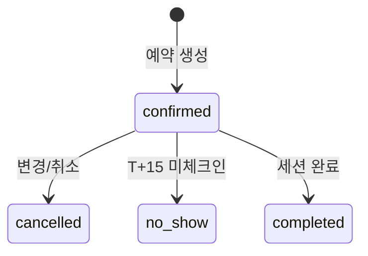

# 4. Reservation · Session · FreeGymVisit · DayPass · BonusCredit (v2)

**Status**: v2 Accepted · **Updated**: 2026-05-16 · **Source of truth**
**관련 결정**: [ADR 0001](../../decisions/0001-consumer-pivot.html) · [ADR 0003](../../decisions/0003-free-gym-add-on.html) · [ADR 0004](../../decisions/0004-one-time-ticket-pricing.html)
**의존**: [5A 예약](../../operations/reservation.html) · [5D 자유 헬스](../../operations/free-gym.html) · [2D 정책](../../members/policies.html)

> **GX 영향**: GX 예약은 `GxBooking` 모델(기존 + `paidAmount`·`walletTransactionId` 추가)로 처리. 이 문서의 `Reservation`·`Session` 등은 PT 레일 전용 (보존·미활성) ([ADR 0011](../../decisions/0011-recovergx-gx-pivot.html)).

> **v2 변경 요약**: 회원 1예약 = **강사 + 프로그램 + 30분 unit**. v1의 `cardioSlotId`·`roomSlotId`·`autoMatchedAt`(자동 매칭) 필드 폐기. 룸 필요 프로그램이면 `assignedRoomId`로 자동 배정. 자유 헬스는 별도 `FreeGymVisit`로 분리 (회차·예약 ❌).

## Reservation (v2)

**Purpose**: 회원 1예약 = 강사 1명 + 프로그램 1개 + 30분 unit (60분=2 unit 묶음 예약 → unit 두 row 또는 unitCount=2 단일 row, 본 스펙은 후자 채택).
**Lifecycle**: `confirmed → checked-in → completed` (또는 `cancelled / no-show`)

### Fields

| Field | Type | Required | Default | Description |
|---|---|---|---|---|
| id | String | ✓ | cuid() | PK |
| memberId | String | ✓ | - | FK |
| mentorId | String | ✓ | - | FK (v2에선 항상 확정, 자동 매칭 대기 ❌) |
| programId | String | ✓ | - | FK → Program |
| categoryId | String | ✓ | - | FK → CourseCategory (denorm) |
| storeId | String | ✓ | - | FK → Store (denorm) |
| startAt | DateTime | ✓ | - | unit 시작 시각 |
| unitCount | Int | ✓ | 1 | 1 (30분) 또는 2 (60분) |
| mentorBlockIds | String[] | ✓ | - | 점유한 MentorBlock id 배열 (길이=unitCount) |
| assignedRoomId | String? | - | null | 룸 필요 프로그램이면 배정된 Room |
| isPro | Boolean | ✓ | false | 멘토가 Pro인지 (denorm, 가격 산출용) |
| ticketId | String | ✓ | - | FK → MembershipTicket (회차 차감 대상) |
| creditsUsed | Int | ✓ | 1 | 일반적으로 1 (60분 예약도 회차 1 — 회차는 unit 아닌 세션 기준) |
| pointsCharged | Int | ✓ | 0 | Pro 옵션 추가금 (5000원 등) |
| sessionId | String? | - | null | FK → Session (1:1) |
| isFixed | Boolean | ✓ | false | FixedSlot 자동 예약 여부 |
| status | ReservationStatus | ✓ | confirmed | confirmed / cancelled / no-show / completed |
| createdAt | DateTime | ✓ | now() | |
| cancelledAt | DateTime? | - | null | |
| cancelReason | String? | - | null | |
| dayPassIssued | Boolean | ✓ | false | 48h~6h 취소 시 발급 여부 |

### Validation
- `mentorBlockIds.length == unitCount` · 모든 block의 `mentorId` 동일 · 연속 30분
- `program.requiresMentor=true`라면 `mentorId` 필수 (v2에서는 항상)
- `program.requiresPrivateRoom=true`라면 `assignedRoomId` 필수
- 룸 필요 시 동일 `(roomId, startAt..startAt+30*unitCount)` 다른 Reservation 충돌 ❌
- `ticketId.creditsRemaining ≥ 1` (트랜잭션 lock)
- `isPro=true` AND `mentor.isPro=true` → `pointsCharged = admin.pro_mentor_surcharge_per_session` (기본 5000)

### Transaction (예약 생성)

```sql
BEGIN;
  -- 1) 회차 lock
  SELECT creditsRemaining FROM MembershipTicket WHERE id=? FOR UPDATE;
  -- 2) MentorBlock(s) status=open → assigned (unitCount개)
  UPDATE MentorBlock SET status='assigned' WHERE id IN (?) AND status='open';
  -- 3) 룸 필요 시 자동 배정 (가용 Room 1개 lock)
  -- 4) Pro 옵션 시 PointBalance 차감
  -- 5) Reservation insert + Session insert (booked)
  -- 6) MembershipTicket.creditsRemaining -= 1
COMMIT;
```

실패 시 전체 롤백 — `INSUFFICIENT_CREDITS` · `BLOCK_TAKEN` · `INSUFFICIENT_ROOM` · `INSUFFICIENT_POINTS` 중 첫 실패 원인 반환.

### State Transitions



### Indexes
- `[memberId, startAt]`
- `[mentorId, startAt]`
- `[storeId, startAt, status]`
- `[ticketId]`

### Common Queries
- 회원 다음 예약: `WHERE memberId=? AND status='confirmed' AND startAt > NOW()`
- 노쇼 cron: `WHERE status='confirmed' AND startAt < NOW() - 15min AND sessionId.checkedInAt IS NULL`

### Edge Cases
- 동시성 (두 회원 같은 MentorBlock): `MentorBlock.status` row lock으로 차단
- 취소 룰 ([2D](../../members/policies.html)): 48h+ = 회차 복원 · 48h~6h = 회차 차감 + DayPass 발급 · 6h 이내 = no-show 처리
- 멘토 노쇼 보상: `BonusCredit` 1매 발급 + 회차 복원

---

## Session

**Purpose**: 실제 진행 단위. Reservation 1:1.
**Lifecycle**: `booked → checked-in → in-progress → completed` (또는 `no-show / cancelled`)

### Fields

| Field | Type | Required | Default | Description |
|---|---|---|---|---|
| id | String | ✓ | cuid() | PK |
| reservationId | String | ✓ | - | FK (1:1) |
| memberId | String | ✓ | - | denorm |
| mentorId | String | ✓ | - | denorm |
| categoryId | String | ✓ | - | denorm |
| storeId | String | ✓ | - | denorm |
| startAt | DateTime | ✓ | - | unit 시작 |
| durationMinutes | Int | ✓ | 30 | 30 또는 60 |
| checkedInAt | DateTime? | - | null | 회원 QR 체크인 |
| startedAt | DateTime? | - | null | 세션 시작 |
| completedAt | DateTime? | - | null | 종료 |
| cancelledAt | DateTime? | - | null | |
| status | SessionStatus | ✓ | booked | booked/checked-in/in-progress/completed/no-show/cancelled |

### Validation
- `reservationId` unique
- 시간 흐름: `startAt ≤ checkedInAt ≤ startedAt ≤ completedAt`
- `durationMinutes` ∈ {30, 60} (Reservation.unitCount × 30)

### Indexes
- `[startAt, status]` · `[memberId, startAt]` · `[mentorId, startAt]`

### Edge Cases
- 카테고리별 진행 흐름은 [4 세션 포맷](../../service/session.html) 참조. 룸 코스(스트레칭·필라테스): 룸 1개 점유. 오픈 공간 코스(1:1 PT): 오픈 공간.
- 자유 헬스는 `Session` ❌ → `FreeGymVisit` 별도.

---

## FreeGymVisit (v2 신규)

**Purpose**: 회차권 보유 회원의 자유 헬스 입장 기록. **회차 차감 ❌, 정산 ❌** ([ADR 0003](../../decisions/0003-free-gym-add-on.html)).
**Lifecycle**: `enter → exit (수동 또는 180분 자동)`

### Fields

| Field | Type | Required | Default | Description |
|---|---|---|---|---|
| id | String | ✓ | cuid() | PK |
| memberId | String | ✓ | - | FK |
| storeId | String | ✓ | - | FK |
| enteredAt | DateTime | ✓ | now() | QR 체크인 시각 |
| exitedAt | DateTime? | - | null | 게이트 exit 또는 자동 마감 |
| autoClosed | Boolean | ✓ | false | 180분 무활동 자동 마감 여부 |
| ticketSnapshot | Json | ✓ | - | 입장 시점 회차권 상태 (만료일·잔여회차) 스냅샷 |

### Validation
- 입장 가능: 회원 활성 `MembershipTicket` 보유 OR 만료 후 30일 이내 (`grace_days_after_expiry`)
- 동시 활성 visit 1건만 (`exitedAt IS NULL` UNIQUE per memberId)

### Indexes
- `[memberId, enteredAt]`
- `[storeId, enteredAt]`
- `[memberId, exitedAt]` (active visit 조회)

### Edge Cases
- 회원 미exit + 180분 경과 → cron 자동 `exitedAt=enteredAt+180min`, `autoClosed=true`
- 비상벨 발생 시 visit row에 `incidentId` 별도 audit table 링크 (10. Audit)

---

## DayPass (당일 예약권)

**Purpose**: 48h~6h 취소 시 자동 발급. 당일 23:59 만료.

### Fields

| Field | Type | Required | Default | Description |
|---|---|---|---|---|
| id | String | ✓ | cuid() | PK |
| memberId | String | ✓ | - | FK |
| issuedAt | DateTime | ✓ | now() | |
| expiresAt | DateTime | ✓ | - | `DATE(issuedAt) 23:59` |
| reason | String | ✓ | - | "late_cancel_48_to_6" |
| sourceReservationId | String | ✓ | - | 발급 근거 |
| used | Boolean | ✓ | false | |
| usedAt | DateTime? | - | null | |
| usedReservationId | String? | - | null | |

### Indexes
- `[memberId, used, expiresAt]`

### Edge Cases
- 만료 시 archive · 동시 보유 시 FIFO

---

## BonusCredit (보상 회차)

**Purpose**: 본사·멘토 사유 노쇼 보상 · Pro 매칭 실패 fallback 보상. 30일 만료.

### Fields

| Field | Type | Required | Default | Description |
|---|---|---|---|---|
| id | String | ✓ | cuid() | PK |
| memberId | String | ✓ | - | FK |
| issuedAt | DateTime | ✓ | now() | |
| expiresAt | DateTime | ✓ | - | issuedAt + 30일 |
| reason | String | ✓ | - | "mentor_no_show" / "pro_unavailable_fallback" |
| sourceReservationId | String? | - | null | |
| used | Boolean | ✓ | false | |
| usedAt | DateTime? | - | null | |
| usedReservationId | String? | - | null | |

### Indexes
- `[memberId, used, expiresAt]`

## 📘 사용 PRD

[👤 세션 진행](../user/2026-05-13-session-flow.html) · [👤 예약](../user/2026-05-13-reservation.html) · [💪 세션 진행](../mentor/2026-05-13-session-flow.html) · [💪 슬롯](../mentor/2026-05-13-reservation.html)

---

## 변경 이력

| 날짜 | 변경 |
|---|---|
| 2026-05-13 | v1 초안 — Reservation(cardio+room+block) · Session · DayPass · BonusCredit |
| 2026-05-16 | **v2 재작성** — 자동 매칭·CardioSlot·RoomSlot 필드 폐기. `programId·categoryId·mentorBlockIds[]·assignedRoomId` 추가. FreeGymVisit 신규. (ADR 0001 · 0003) |
