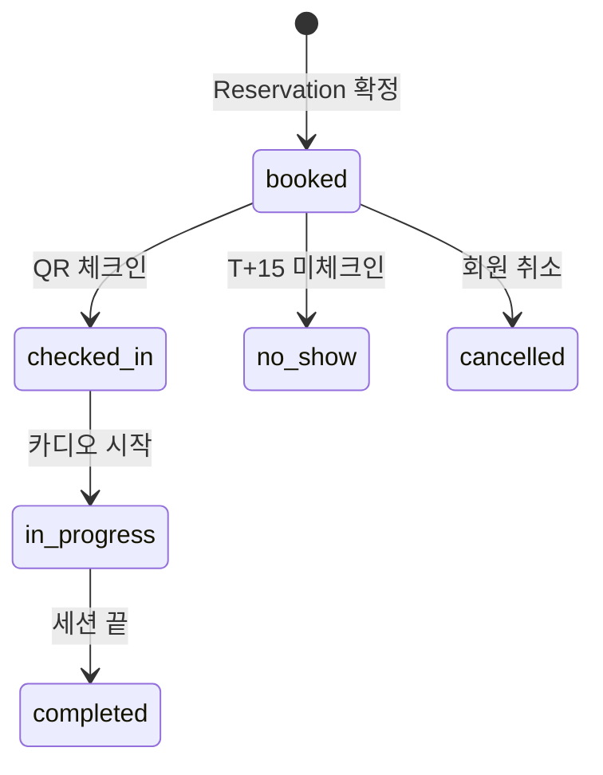

# 4. Reservation·Session·DayPass·BonusCredit

예약 + 세션 + 보상권. [5A 예약](../../operations/reservation.html), [2D 정책](../../members/policies.html) 정책 반영.

## Reservation

**Purpose**: 회원 1예약 = 카디오 30분 슬롯 + 방 60분 슬롯 + 멘토 30분 블록 묶음.
**Related PRDs**: [👤 예약](../user/2026-05-13-reservation.html) · [🏢 예약 시스템](../platform/2026-05-13-reservation-system.html)
**Lifecycle**: 회원 예약 → 매칭 → 체크인 → 세션 진행 → 완료 (또는 취소/노쇼)

### Fields

| Field | Type | Required | Default | Description |
|---|---|---|---|---|
| id | String | ✓ | cuid() | PK |
| memberId | String | ✓ | - | FK |
| sessionId | String | ✓ | - | FK → Session (1:1) |
| storeId | String | ✓ | - | FK (denorm) |
| cardioSlotId | String | ✓ | - | FK → CardioSlot |
| roomSlotId | String | ✓ | - | FK → RoomSlot |
| mentorBlockId | String? | - | null | FK → MentorBlock (자동 매칭 대기 시 null) |
| mentorId | String? | - | null | FK → Mentor (FK lookup 편의) |
| mentorTier | MentorTier | ✓ | verified | 진행 당시 멘토 등급 |
| startAt | DateTime | ✓ | - | 카디오 시작 시각 |
| matchingMode | MatchingMode | ✓ | manual | manual / auto |
| autoMatchedAt | DateTime? | - | null | 24h 거절 카운트다운 기준 |
| pointsCharged | Int? | - | null | Pro 인증 매칭 시 차감 포인트 |
| isFixed | Boolean | ✓ | false | 고정 슬롯 자동 예약 여부 |
| status | ReservationStatus | ✓ | confirmed | confirmed/rejected/cancelled/no-show/completed |
| createdAt | DateTime | ✓ | now() | |
| cancelledAt | DateTime? | - | null | |
| cancelReason | String? | - | null | |

### Validation
- (cardioSlotId, roomSlotId, mentorBlockId) 모두 status=available 또는 매칭 가능 상태에서 동시 점유
- startAt = cardioSlot.startAt
- roomSlot.startAt = startAt + 30min
- mentorBlock.startAt = roomSlot.startAt + 30min (방 60분 중 후반 30분)
- isFixed=true → memberId의 FixedSlot 매칭

### State Transitions

```mermaid
stateDiagram-v2
    [*] --> confirmed: 예약 생성
    confirmed --> rejected: 자동 매칭 24h 거절
    confirmed --> cancelled: 변경/취소
    confirmed --> no-show: T+15 미체크인
    confirmed --> completed: 세션 완료
    cancelled --> [*]
    rejected --> confirmed: 재매칭 성공
```

### Indexes
- `[memberId, startAt]` — 회원 예약 리스트
- `[mentorId, startAt]` — 멘토 일정
- `[startAt, status]` — 오늘 진행 예약 조회
- `[storeId, startAt]` — 지점별 운영

### Common Queries
- 회원 다음 예약: `WHERE memberId=? AND status='confirmed' AND startAt > NOW()`
- 매칭 거절 가능 (24h 내): `WHERE memberId=? AND matchingMode='auto' AND autoMatchedAt > NOW() - 24h AND status='confirmed'`
- 노쇼 처리: cron `WHERE status='confirmed' AND startAt < NOW() - 15min AND checkedInAt IS NULL` → no-show

### Edge Cases
- 동시성 (두 회원 같은 슬롯 시도): DB row lock
- 매칭 후 회원 거절 → 다른 멘토 자동 매칭 → 또 거절 (반복) 시 수동 모드 권유
- 변경 시 슬롯 swap: 트랜잭션으로 처리
- 취소 시점에 따른 룰: CancellationLog 기록 (별도)

---

## Session

**Purpose**: 실제 세션 진행 단위. Reservation 1:1.
**Related PRDs**: [🏢 세션 시스템](../platform/2026-05-13-session-system.html)
**Lifecycle**: booked → checked-in → in-progress → completed (또는 no-show / cancelled)

### Fields

| Field | Type | Required | Default | Description |
|---|---|---|---|---|
| id | String | ✓ | cuid() | PK |
| reservationId | String | ✓ | - | FK (1:1) |
| memberId | String | ✓ | - | denorm |
| mentorId | String? | - | null | denorm (자동 매칭 대기 시 null) |
| storeId | String | ✓ | - | denorm |
| startAt | DateTime | ✓ | - | 세션 시작 (카디오 시작) |
| checkedInAt | DateTime? | - | null | 회원 체크인 시각 |
| startedAt | DateTime? | - | null | 카디오 시작 |
| mentorEnteredAt | DateTime? | - | null | 멘토 방 입장 (T+30) |
| completedAt | DateTime? | - | null | 세션 종료 |
| cancelledAt | DateTime? | - | null | |
| status | SessionStatus | ✓ | booked | booked/checked-in/in-progress/completed/no-show/cancelled |

### Validation
- reservationId unique (1:1)
- 시간 흐름: startAt < checkedInAt < mentorEnteredAt < completedAt

### State Transitions



### Indexes
- `[startAt, status]` — 오늘 세션 조회
- `[memberId, startAt]` — 회원 히스토리
- `[mentorId, startAt]` — 멘토 일정·이력

### Common Queries
- 오늘 진행 세션: `WHERE DATE(startAt) = TODAY AND status IN ('checked_in','in_progress')`
- 회원 누적 세션: `WHERE memberId=? AND status='completed'`

### Edge Cases
- 회원 미체크인 + 멘토 도착 = 멘토 대기 상태 (T+15에 노쇼 판정)
- 세션 중 부상 → 강제 종료 (`completed` + record에 사유 메모)

---

## DayPass (당일 예약권)

**Purpose**: 48h-6h 취소 시 발급되는 당일 예약권 (당일 23:59 만료).
**Related PRDs**: [👤 예약·취소](../user/2026-05-13-reservation.html) · [👤 멤버십](../user/2026-05-13-membership-payment.html)
**Lifecycle**: 발급 → 사용 (또는 만료)

### Fields

| Field | Type | Required | Default | Description |
|---|---|---|---|---|
| id | String | ✓ | cuid() | PK |
| memberId | String | ✓ | - | FK |
| issuedAt | DateTime | ✓ | now() | 발급 시각 |
| expiresAt | DateTime | ✓ | - | 발급일 23:59 |
| reason | String | ✓ | - | "late_cancel_48_to_6" |
| sourceReservationId | String | ✓ | - | 발급 근거 예약 |
| used | Boolean | ✓ | false | |
| usedAt | DateTime? | - | null | |
| usedReservationId | String? | - | null | 사용된 예약 |

### Validation
- expiresAt = DATE(issuedAt) + 23:59
- used=true 시 usedAt, usedReservationId 필수

### Indexes
- `[memberId, used, expiresAt]` — 활성 당일 예약권 조회

### Common Queries
- 회원 활성 당일권: `WHERE memberId=? AND used=false AND expiresAt > NOW()`

### Edge Cases
- 발급 후 회원이 그날 안 옴 → 만료 (used=false 유지, 자동 archive)
- 발급 후 즉시 사용 시도 → OK
- 동시 여러 장 보유 시 → FIFO 사용

---

## BonusCredit (보상 회차)

**Purpose**: Pro 인증 예약 → 일반 멘토 변경 시 발급되는 추가 1회권. 멘토 노쇼 보상도 같은 모델.
**Related PRDs**: [👤 멤버십](../user/2026-05-13-membership-payment.html) · [🏢 예약 시스템](../platform/2026-05-13-reservation-system.html)
**Lifecycle**: 발급 → 사용 (또는 만료, 30일)

### Fields

| Field | Type | Required | Default | Description |
|---|---|---|---|---|
| id | String | ✓ | cuid() | PK |
| memberId | String | ✓ | - | FK |
| issuedAt | DateTime | ✓ | now() | |
| expiresAt | DateTime | ✓ | - | issuedAt + 30일 |
| reason | String | ✓ | - | "pro_mentor_swap" / "mentor_no_show" |
| sourceReservationId | String | ✓ | - | 발급 근거 |
| used | Boolean | ✓ | false | |
| usedAt | DateTime? | - | null | |
| usedReservationId | String? | - | null | |

### Validation
- reason enum
- expiresAt > issuedAt

### Indexes
- `[memberId, used, expiresAt]` — 활성 보상권

### Common Queries
- 회원 활성 보상권: `WHERE memberId=? AND used=false AND expiresAt > NOW()`

### Edge Cases
- 보상권 만료 (30일 미사용) → 자동 archive
- 회원 탈퇴 시 → 미사용 보상권 무효화 (환불 ❌)

---

| 2026-05-13 | 초안 — Reservation·Session·DayPass·BonusCredit 상세 명세 |
