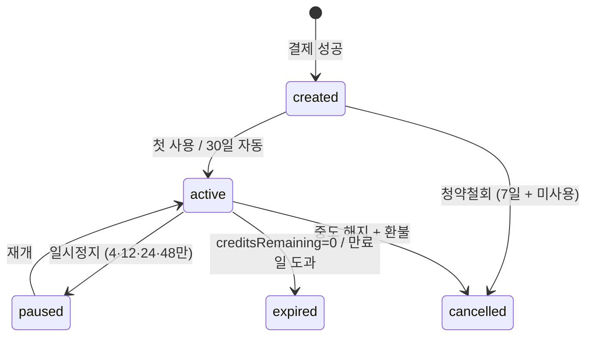

# 7. MembershipTicket · PointBalance · Payment · Refund (v2)

**Status**: v2 Accepted · **Updated**: 2026-05-16 · **Source of truth**
**관련 결정**: [ADR 0001](../../decisions/0001-consumer-pivot.html) · [ADR 0004](../../decisions/0004-one-time-ticket-pricing.html)
**의존**: [2B 멤버십](../../members/membership.html) · [2C 가격](../../members/pricing.html) · [2D 정책](../../members/policies.html)

> **v2 변경 요약**: "주 1회권/주 2회권 + contractMonths" 이원 구조 폐기. **회차권 5단(1·4·12·24·48회) 단일 모델**로 통합. `ticketType` 한 필드로 라인업 식별. Pro 옵션 = 회당 +5,000원 포인트 (회원 결제, 멘토 100% 인센티브).

## MembershipTicket (v2 — 회차권 단일 모델)

**Purpose**: 회원이 보유한 회차권 1매. 모든 회차권은 동일 라이프사이클 — `ticketType`(=회차 라인업)만 가변.
**Lifecycle**: `결제 → created → active(첫 사용) → expired/cancelled`

### Fields

| Field | Type | Required | Default | Description |
|---|---|---|---|---|
| id | String | ✓ | cuid() | PK |
| memberId | String | ✓ | - | FK |
| ticketType | TicketType | ✓ | - | one / four / twelve / twenty_four / forty_eight |
| creditsTotal | Int | ✓ | - | 1 / 4 / 12 / 24 / 48 (ticketType과 정합) |
| creditsRemaining | Int | ✓ | - | 잔여 회차 |
| pricePerCredit | Int | ✓ | - | 정상 회당가 (40k/35k/30k/27k/25k) — 환불 산출 기준 |
| priceCharged | Int | ✓ | - | 실제 결제액 |
| paidAt | DateTime | ✓ | - | 결제 완료 시각 |
| activatedAt | DateTime? | - | null | 첫 사용 시점 |
| autoActivateBy | DateTime | ✓ | - | paidAt + 30일 (미사용 시 자동 활성화) |
| expiresAt | DateTime? | - | null | 활성화 후 산출 (라인업별 유효기간 + pauseUsedDays) |
| pausedAt | DateTime? | - | null | 일시정지 시작 |
| resumedAt | DateTime? | - | null | 재개 |
| pauseUsedDays | Int | ✓ | 0 | 누적 정지 일수 (잔여 회차 30% 한도) |
| autoRenew | Boolean | ✓ | false | 만료 시 자동 재발급 (옵션) |
| status | TicketStatus | ✓ | created | created / active / paused / expired / cancelled |
| createdAt | DateTime | ✓ | now() | |

### Validation
- `creditsTotal`은 `ticketType`과 1:1 매핑 (1·4·12·24·48)
- `creditsRemaining ≤ creditsTotal`, ≥ 0
- 한 회원 = 1 active 또는 created ticket (다중 동시 보유 ❌ — 추가 결제는 잔여 + 신규 row 분리도 가능하나 베타는 단일 보유)
- 일시정지 한도: `pauseUsedDays ≤ floor(creditsRemaining_at_pause_start × 0.30) × (avgDaysPerCredit)` — 운영 변수
- `pricePerCredit` = `admin.PricingConfig.ticket_{N}_price / N` (저장 시점)

### State Transitions



### 환불 산출 (회차권 5단 공식 — [2D](../../members/policies.html))

```
환불액 = priceCharged - (pricePerCredit × usedCredits)
       (단, 환불액 < 0 시 0원)
usedCredits = creditsTotal - creditsRemaining
```

- **1회차권 (`ticketType=one`)**: 결제 후 24h + 미사용 = 100%, 그 외 환불 ❌
- **4·12·24·48회차권**: 위 공식 적용
- 청약철회 (결제 7일 + 미사용): 모든 ticketType 전액 100%

### Indexes
- `[memberId, status]` · `[expiresAt, status]` (만료 cron) · `[autoActivateBy]` (자동 활성화 cron)

### Common Queries
- 회원 활성 회차권: `WHERE memberId=? AND status='active'`
- 자유 헬스 입장 자격 ([5D](../../operations/free-gym.html)): `WHERE memberId=? AND (status IN ('active','paused') OR (status='expired' AND expiresAt > NOW() - 30d))`

### Edge Cases
- 1회차권 = `pauseUsedDays` 사용 ❌ (정지 자체 불가)
- 자동 갱신 (`autoRenew=true`): 만료 D-1 cron이 같은 ticketType + 현재 PricingConfig 가격으로 새 row 생성
- 결제는 됐지만 활성화 전 (`created`) 상태에서 청약철회 = 100% 환불

---

## PointBalance (Pro 옵션 — v2 유지)

**Purpose**: Pro 강사 매칭 시 회당 +5,000원 차감 ([ADR 0004](../../decisions/0004-one-time-ticket-pricing.html) §3).

### Fields

| Field | Type | Required | Default | Description |
|---|---|---|---|---|
| memberId | String | ✓ | - | PK (1:1 with Member) |
| balance | Int | ✓ | 0 | 잔액 (원) |
| lifetimeCharged | Int | ✓ | 0 | 누적 충전 |
| lifetimeSpent | Int | ✓ | 0 | 누적 사용 |
| lastChargedAt | DateTime? | - | null | |
| lastSpentAt | DateTime? | - | null | |

### Validation
- `balance ≥ 0` · `lifetimeCharged - lifetimeSpent = balance + 환불액`
- Pro 매칭 시 잔액 부족 → 일반 멘토로 fallback 또는 충전 안내

### Edge Cases
- 환불: 미사용 현금 결제분 100% / 보너스분 ❌

---

## Payment

**Purpose**: PG 결제 트랜잭션 (회차권·포인트). v1의 "membership" type을 "ticket"로 갱신.

### Fields

| Field | Type | Required | Default | Description |
|---|---|---|---|---|
| id | String | ✓ | cuid() | PK |
| memberId | String | ✓ | - | FK |
| type | PaymentType | ✓ | - | ticket / point / bonus |
| referenceId | String? | - | null | MembershipTicket.id / PointBalance.memberId |
| amount | Int | ✓ | - | 원화 |
| currency | String | ✓ | KRW | |
| status | PaymentStatus | ✓ | pending | pending/paid/failed/refunded |
| pgProvider | String? | - | null | "toss" / "portone" |
| pgTransactionId | String? | - | null | unique |
| pgRawResponse | Json? | - | null | |
| paidAt | DateTime? | - | null | |
| refundedAt | DateTime? | - | null | |
| description | String? | - | null | 예: "24회차권 결제" |
| createdAt | DateTime | ✓ | now() | |

### Validation
- `amount > 0`
- `(pgProvider, pgTransactionId)` unique
- `type='ticket'` → `referenceId` = `MembershipTicket.id` 필수

### Indexes
- `[memberId, paidAt]` · `pgTransactionId` (unique) · `[status, createdAt]`

---

## Refund

**Purpose**: 환불 기록 (중도해지 · 청약철회 · 노쇼 보상).

### Fields

| Field | Type | Required | Default | Description |
|---|---|---|---|---|
| id | String | ✓ | cuid() | PK |
| paymentId | String | ✓ | - | FK |
| ticketId | String? | - | null | 회차권 환불이면 link |
| usedCredits | Int | ✓ | 0 | 사용 회차 (산식 입력) |
| pricePerCreditSnapshot | Int | ✓ | 0 | 산출 당시 정상 회당가 |
| refundAmount | Int | ✓ | - | 환불액 |
| fee | Int | ✓ | 0 | 위약금 (v2 기본 0) |
| reason | String | ✓ | - | "withdraw_7d" / "cancel_pro_rata" / "compensation" |
| processedAt | DateTime? | - | null | |
| pgRefundId | String? | - | null | |
| status | String | ✓ | pending | pending/processed/failed |

### Validation
- `refundAmount + fee ≤ payment.amount`
- 산출식: `refundAmount = max(0, payment.amount - pricePerCreditSnapshot × usedCredits)` (4회+ 회차권)
- 1회차권: 24h + 미사용 = `refundAmount = payment.amount`, 그 외 0

### Indexes
- `paymentId` · `[status, createdAt]`

## 📘 사용 PRD

[👤 멤버십·결제](../user/2026-05-13-membership-payment.html) · [🏢 멤버십 시스템](../platform/2026-05-13-membership-system.html) · [💳 결제 흐름](../payments/flow.html)

---

## 변경 이력

| 날짜 | 변경 |
|---|---|
| 2026-05-13 | v1 초안 — Membership(week1/week2 + contractMonths) · PointBalance · Payment · Refund |
| 2026-05-16 | **v2 재작성** — `MembershipTicket` 단일 모델 (ticketType 1·4·12·24·48). 환불 공식 5단 통일. Payment.type "ticket" 갱신. (ADR 0004) |
