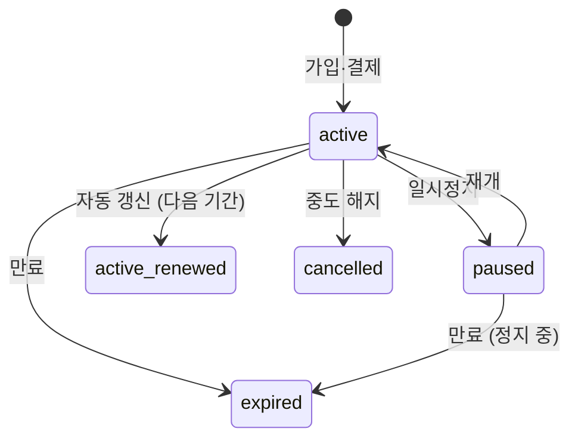
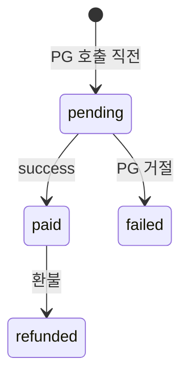

# 7. Membership — Membership·PointBalance·Payment·Refund

회원 멤버십 + 결제. [2B 멤버십](../../members/membership.html), [2D 정책](../../members/policies.html) 정책 반영.

## Membership

**Purpose**: 회원 활성 멤버십 (주 1·2회권 + 약정 + 자동결제).
**Related PRDs**: [👤 멤버십·결제](../user/2026-05-13-membership-payment.html) · [🏢 멤버십 시스템](../platform/2026-05-13-membership-system.html)
**Lifecycle**: 가입 → active → (일시정지) paused → 갱신 → 만료 또는 해지

### Fields

| Field | Type | Required | Default | Description |
|---|---|---|---|---|
| id | String | ✓ | cuid() | PK |
| memberId | String | ✓ | - | FK |
| type | MembershipType | ✓ | - | week1 / week2 |
| creditsRemaining | Int | ✓ | - | 주 1=4, 주 2=8 기준 (이번 달) |
| contractMonths | Int | ✓ | 1 | 1, 3, 6, 12 |
| discountRate | Decimal(3,2) | ✓ | 0 | 0, 0.05, 0.10, 0.15 |
| pricePerMonth | Int | ✓ | - | 정상가 (할인 전) |
| priceCharged | Int | ✓ | - | 실제 결제액 (할인 적용) |
| startedAt | DateTime | ✓ | - | 멤버십 시작 |
| expiresAt | DateTime | ✓ | - | 약정 만료 (일시정지 시 연장) |
| pausedAt | DateTime? | - | null | 일시정지 시작 |
| resumedAt | DateTime? | - | null | 재개 |
| pauseUsedDays | Int | ✓ | 0 | 누적 일시정지 일수 |
| autoRenew | Boolean | ✓ | true | |
| status | MembershipStatus | ✓ | active | active/paused/expired/cancelled |
| createdAt | DateTime | ✓ | now() | |

### Validation
- 한 회원 = 1 active membership (status='active')
- creditsRemaining: week1 = 0-4, week2 = 0-8
- pauseUsedDays ≤ contractMonths × 30 × 0.30
- expiresAt = startedAt + contractMonths × 30일 + pauseUsedDays
- discountRate enum {0, 0.05, 0.10, 0.15}

### State Transitions

### Indexes
- `[memberId, status]` — 회원 활성 멤버십 조회
- `[expiresAt]` — 만료 임박 cron
- `[autoRenew, expiresAt]` — 갱신 cron

### Common Queries
- 회원 활성 멤버십: `WHERE memberId=? AND status='active'`
- 갱신 임박 (D-7): `WHERE expiresAt BETWEEN NOW()+6d AND NOW()+7d AND autoRenew=true`
- 일시정지 한도 도달: `WHERE pauseUsedDays >= contractMonths * 30 * 0.30`

### Edge Cases
- 정지 중 약정 만료 → expired 상태 (회원 알림)
- creditsRemaining 0 + 다음 갱신 전 → 회원 다른 결제 권유 또는 대기
- 일시정지 한도 초과 신청 → UI에서 차단
- 자동 갱신 시 가격 변경 (본사가 정가 인상) → 7일 전 알림 + 동의

---

## PointBalance

**Purpose**: 회원 포인트 잔액 (Pro 인증 멘토 예약 시 차감).
**Related PRDs**: [👤 멤버십·결제](../user/2026-05-13-membership-payment.html)
**Lifecycle**: 충전 → 차감 → 만료 (선택, Phase 1엔 무기한)

### Fields

| Field | Type | Required | Default | Description |
|---|---|---|---|---|
| memberId | String | ✓ | - | PK (1:1 with Member) |
| balance | Int | ✓ | 0 | 포인트 (원 단위) |
| lifetimeCharged | Int | ✓ | 0 | 누적 충전액 |
| lifetimeSpent | Int | ✓ | 0 | 누적 사용액 |
| lastChargedAt | DateTime? | - | null | 마지막 충전 |
| lastSpentAt | DateTime? | - | null | 마지막 사용 |

### Validation
- balance ≥ 0
- balance + spent = charged (정합성)

### Indexes
- `memberId` (PK)

### Common Queries
- 회원 포인트 잔액: `WHERE memberId=?`
- 활발한 포인트 사용자: `ORDER BY lifetimeSpent DESC`

### Edge Cases
- Pro 인증 예약 시 잔액 부족 → 일반 멘토로 fallback
- 환불 시 미사용분 100% 환불 (현금 결제분), 보너스분 ❌
- 동시 차감 (race condition) → DB transaction + row lock

---

## Payment

**Purpose**: 결제 트랜잭션 (멤버십·포인트·체험 등).
**Related PRDs**: [🏢 멤버십 시스템](../platform/2026-05-13-membership-system.html) · [💳 결제 PG](../../specs/payments/flow.html)
**Lifecycle**: pending → paid (또는 failed) → refunded (선택)

### Fields

| Field | Type | Required | Default | Description |
|---|---|---|---|---|
| id | String | ✓ | cuid() | PK |
| memberId | String | ✓ | - | FK |
| type | PaymentType | ✓ | - | membership/point/trial/bonus |
| referenceId | String? | - | null | Membership·PointBalance 연결 |
| amount | Int | ✓ | - | 원화 |
| currency | String | ✓ | KRW | |
| status | PaymentStatus | ✓ | pending | pending/paid/failed/refunded |
| pgProvider | String? | - | null | "toss" / "portone" |
| pgTransactionId | String? | - | null | unique |
| pgRawResponse | Json? | - | null | 디버깅용 |
| paidAt | DateTime? | - | null | |
| refundedAt | DateTime? | - | null | |
| description | String? | - | null | "주 2회권 12개월 첫 결제" |
| createdAt | DateTime | ✓ | now() | |

### Validation
- amount > 0
- status='paid' 시 paidAt, pgTransactionId 필수
- (pgProvider, pgTransactionId) unique (중복 결제 방지)

### State Transitions

### Indexes
- `[memberId, paidAt]` — 회원 결제 내역
- `pgTransactionId` (unique)
- `[status, createdAt]` — pending 상태 5분+ → 알림

### Common Queries
- 회원 결제 내역: `WHERE memberId=? ORDER BY paidAt DESC`
- 일별 매출: `SUM(amount) WHERE status='paid' AND DATE(paidAt) = ?`

### Edge Cases
- PG webhook 누락 → cron 5분 간격 동기화
- 결제 후 회원이 즉시 환불 신청 → 청약철회 룰 적용
- 부분 환불 → Refund.refundAmount < Payment.amount

---

## Refund

**Purpose**: 환불 기록 (중도 해지·청약철회·노쇼 보상 등).
**Related PRDs**: [💳 결제 흐름](../../specs/payments/flow.html)
**Lifecycle**: 신청 → 산출 → 처리 (PG API) → 완료

### Fields

| Field | Type | Required | Default | Description |
|---|---|---|---|---|
| id | String | ✓ | cuid() | PK |
| paymentId | String | ✓ | - | FK (1:1 또는 N:1 부분환불) |
| usedCredits | Int | ✓ | 0 | 사용 회차 |
| refundAmount | Int | ✓ | - | 환불액 |
| fee | Int | ✓ | 0 | 위약금 (현재 0) |
| reason | String | ✓ | - | "중도해지" / "청약철회" / "본사노쇼보상" |
| processedAt | DateTime? | - | null | |
| pgRefundId | String? | - | null | PG 환불 트랜잭션 |
| status | String | ✓ | pending | pending/processed/failed |

### Validation
- refundAmount + fee ≤ payment.amount
- reason enum
- paymentId당 누적 refund ≤ payment.amount

### Indexes
- `paymentId` — 결제별 환불
- `[status, createdAt]` — pending refund 추적

### Common Queries
- 회원 환불 이력: `JOIN Payment WHERE Payment.memberId=?`
- 일별 환불액: `SUM(refundAmount) WHERE DATE(processedAt) = ?`

### Edge Cases
- PG 환불 실패 → 운영자 수동 처리 + 회원 알림
- 환불 후 멘토 정산 회수 → DistributionEntry 차감 (다음 격주)

---

| 2026-05-13 | 초안 — Membership·PointBalance·Payment·Refund 상세 명세 |
