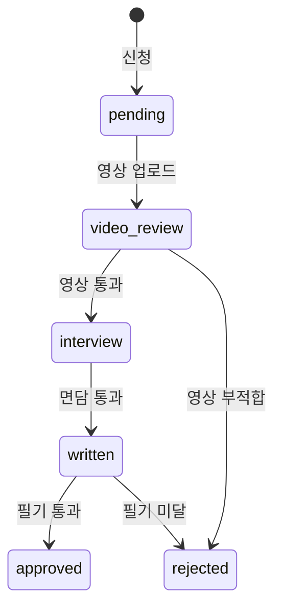

# 8. Mentor System — VerificationCourse·ProCertificationApplication·MentorRateChange·MentorComplaint·TierChange

멘토 등급·심사·컴플레인. [3F](../../partners/peer-leader.html), [3H](../../partners/quality.html), [3G](../../partners/payout.html) 정책 반영.

## VerificationCourse

**Purpose**: 본사 검증 코스 회차 (가입 → 일반 멘토 자격). Phase 1엔 후순위 운영.
**Related PRDs**: [💪 등급·Pro 인증](../mentor/2026-05-13-mentor-tier.html) · [🏢 멘토 등급 시스템](../platform/2026-05-13-mentor-tier-system.html)
**Lifecycle**: 본사 운영팀 일정 등록 → 참가 → 합격/불합격

### Fields

| Field | Type | Required | Default | Description |
|---|---|---|---|---|
| id | String | ✓ | cuid() | PK |
| scheduledAt | DateTime | ✓ | - | 코스 시작 |
| durationHours | Int | ✓ | 8 | 4-8h |
| modules | String[] | ✓ | - | ["운동안전", "AI사용", "CS"] |
| capacity | Int | ✓ | 20 | |
| status | String | ✓ | scheduled | scheduled/in_progress/completed/cancelled |
| createdAt | DateTime | ✓ | now() | |

### VerificationAttendance (별도 테이블, M:N)

| Field | Type | Description |
|---|---|---|
| id | String | PK |
| courseId | String | FK |
| mentorId | String | FK |
| attendedModules | String[] | 출석 모듈 |
| demoPassed | Boolean | 시범 세션 합격 여부 |
| evaluatorId | String? | 평가자 (Admin) |
| approvedAt | DateTime? | 본사 승인 시각 |

### Validation
- 모든 모듈 출석 + demoPassed=true → 자동 mentor.tier='verified'
- 불합격 시 → 3개월 후 재시도 가능

### Common Queries
- 다음 예정 코스: `WHERE status='scheduled' ORDER BY scheduledAt`
- 멘토 합격 여부: `JOIN VerificationAttendance WHERE mentorId=? AND demoPassed=true`

---

## ProCertificationApplication

**Purpose**: Pro 인증 신청·심사 워크플로우 (Phase 1 후순위, 스키마는 신설).
**Related PRDs**: [💪 등급·Pro](../mentor/2026-05-13-mentor-tier.html) · [🏢 멘토 등급](../platform/2026-05-13-mentor-tier-system.html)
**Lifecycle**: 신청 → 영상 → 면담 → 필기 → 결과

### Fields

| Field | Type | Required | Default | Description |
|---|---|---|---|---|
| id | String | ✓ | cuid() | PK |
| mentorId | String | ✓ | - | FK |
| appliedAt | DateTime | ✓ | now() | |
| status | ApplicationStatus | ✓ | pending | pending/video_review/interview/written/approved/rejected |
| videoUrl | String? | - | null | 세션 영상 (S3 등) |
| videoSubmittedAt | DateTime? | - | null | |
| videoReviewScore | Decimal(2,1)? | - | null | 1-5 |
| videoReviewer | String? | - | null | admin id |
| interviewScheduledAt | DateTime? | - | null | |
| interviewScore | Decimal(2,1)? | - | null | |
| writtenScore | Decimal(2,1)? | - | null | |
| decisionAt | DateTime? | - | null | |
| decisionBy | String? | - | null | admin id |
| decisionNotes | Text? | - | null | |

### Validation
- 같은 멘토 동시 1 active application (status NOT IN ('approved', 'rejected'))
- 통과 조건 (Phase 1 가설): sessionCount ≥ 100 AND averageRating ≥ 4.3 AND rebookRate ≥ 0.6 AND licenseVerified=true

### State Transitions

### Indexes
- `[mentorId, status]` — 1 active 신청 enforce
- `[status, appliedAt]` — admin 큐

### Common Queries
- 심사 대기열: `WHERE status IN ('video_review', 'interview', 'written') ORDER BY appliedAt`
- 멘토 진행 상황: `WHERE mentorId=?`

---

## MentorRateChange

**Purpose**: Pro 인증 멘토의 단가 변경 이력 (감사·정산 lookup).
**Related PRDs**: [💪 등급](../mentor/2026-05-13-mentor-tier.html) · [💪 정산](../mentor/2026-05-13-payout.html)
**Lifecycle**: 멘토 변경 → 기록 → 다음 결제부터 적용

### Fields

| Field | Type | Required | Default | Description |
|---|---|---|---|---|
| id | String | ✓ | cuid() | PK |
| mentorId | String | ✓ | - | FK |
| oldRate | Int | ✓ | - | 변경 전 단가 |
| newRate | Int | ✓ | - | 변경 후 |
| changedAt | DateTime | ✓ | now() | 신청 시각 |
| appliedFromDate | DateTime | ✓ | - | 적용 시작일 (보통 changedAt + N시간) |

### Validation
- newRate ∈ [mentor.proMinRate, mentor.proMaxRate]
- mentor.tier='pro_certified' 필수

### Indexes
- `[mentorId, appliedFromDate]` — 정산 시 진행 당시 단가 lookup

### Common Queries
- 진행 당시 단가: `SELECT newRate WHERE mentorId=? AND appliedFromDate ≤ sessionDate ORDER BY appliedFromDate DESC LIMIT 1`

### Edge Cases
- 변경 후 매칭된 예약 = 기존 단가 유지 (사전 매칭 시점 단가 lookup)
- 빈번한 변경 (월 5+회) → 운영 알림

---

## MentorComplaint

**Purpose**: 회원 → 멘토 컴플레인. 3단계 처리.
**Related PRDs**: [💪 등급](../mentor/2026-05-13-mentor-tier.html) · [🏢 멘토 등급 시스템](../platform/2026-05-13-mentor-tier-system.html)
**Lifecycle**: 회원 신고 → admin 검토 → 처리 (피드백·등급 변경·자격 정지)

### Fields

| Field | Type | Required | Default | Description |
|---|---|---|---|---|
| id | String | ✓ | cuid() | PK |
| memberId | String | ✓ | - | 신고자 |
| mentorId | String | ✓ | - | 대상 멘토 |
| sessionId | String? | - | null | 관련 세션 |
| severity | String | ✓ | low | low/medium/high |
| text | Text | ✓ | - | 회원 신고 내용 |
| status | String | ✓ | pending | pending/in_review/resolved/escalated |
| resolution | String? | - | null | feedback/tier_hold/tier_down/suspension |
| adminNotes | Text? | - | null | |
| resolvedAt | DateTime? | - | null | |
| resolvedBy | String? | - | null | admin id |
| tierImpact | Boolean | ✓ | false | 등급에 영향 줬는지 |
| memberCompensation | Int? | - | null | 회원 보상 회차 (있을 시) |
| createdAt | DateTime | ✓ | now() | |

### Validation
- severity enum
- resolution enum (정의된 4종)
- 3차 컴플레인 (mentorId당) → severity 자동 high

### Indexes
- `[mentorId, status]` — 멘토별 미해결 컴플레인
- `[status, severity, createdAt]` — admin 우선순위 큐

### Common Queries
- 멘토 누적 컴플레인: `COUNT WHERE mentorId=? AND tierImpact=true`
- admin 처리 대기: `WHERE status='pending' ORDER BY severity DESC, createdAt`

### Edge Cases
- 회원이 보복성 신고 → admin 검토 후 dismissed
- 멘토 3차 컴플레인 → 자동 suspension 트리거 (admin 최종 결정)
- 컴플레인 해결 후 회원 보상 발급 (BonusCredit)

---

## TierChange

**Purpose**: 멘토 등급 변경 감사 로그.
**Related PRDs**: [🏢 멘토 등급 시스템](../platform/2026-05-13-mentor-tier-system.html)
**Lifecycle**: 자동 또는 admin 수동 변경 → 기록

### Fields

| Field | Type | Required | Default | Description |
|---|---|---|---|---|
| id | String | ✓ | cuid() | PK |
| mentorId | String | ✓ | - | FK |
| fromTier | MentorTier | ✓ | - | verified / pro_certified |
| toTier | MentorTier | ✓ | - | |
| reason | String | ✓ | - | "Pro 인증 통과" / "3차 컴플레인" / "자격증 만료" |
| changedAt | DateTime | ✓ | now() | |
| changedBy | String | ✓ | - | admin id 또는 'system' |
| relatedApplicationId | String? | - | null | Pro 신청 통과 시 |
| relatedComplaintId | String? | - | null | 컴플레인 인한 강등 시 |

### Validation
- fromTier ≠ toTier
- reason 필수

### Indexes
- `[mentorId, changedAt]` — 멘토 등급 이력
- `[changedAt]` — 일별 변경

### Common Queries
- 멘토 등급 변경 이력: `WHERE mentorId=? ORDER BY changedAt DESC`
- 이번 달 강등: `WHERE toTier='verified' AND fromTier='pro_certified' AND changedAt > MONTH_START`

### Edge Cases
- 동시 여러 reason (예: Pro 인증 통과 + 즉시 컴플레인) → 별개 TierChange 기록

## 📘 사용 PRD

[💪 등급·Pro 인증](../mentor/2026-05-13-mentor-tier.html) · [🏢 멘토 등급 시스템](../platform/2026-05-13-mentor-tier-system.html)

---

| 2026-05-13 | 초안 — Mentor System 5 모델 상세 명세 |
