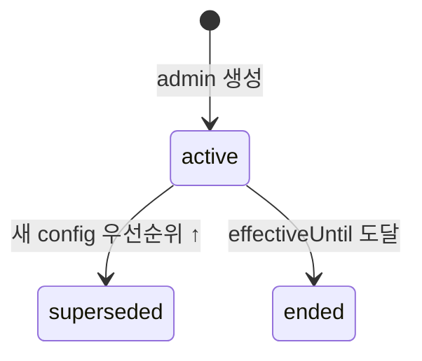
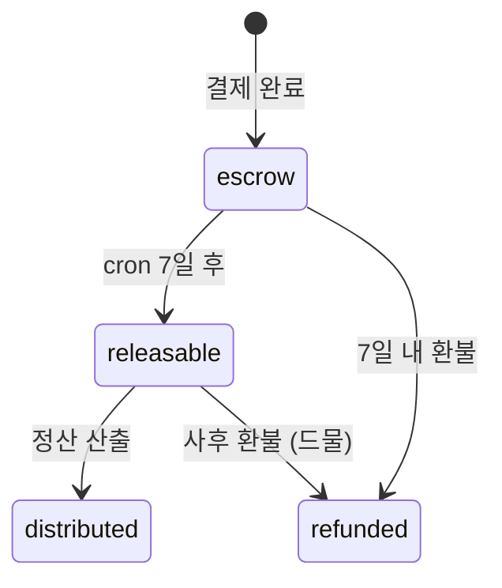
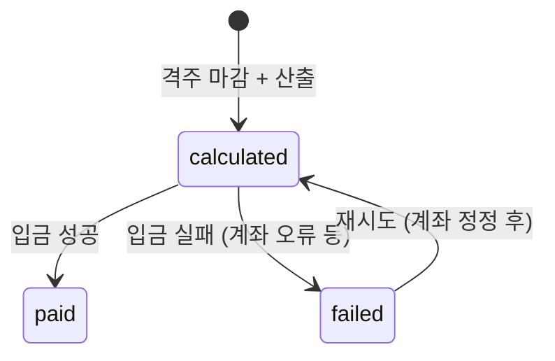

# 9. Payout — GX 정산 + PT 레일 정산

정산 시스템 + **가변 가격·분배 설정**. [3G 정산](../../partners/payout.html), [6C 본사 수익](../../expansion/revenue-share.html), [2C 가격](../../members/pricing.html) 정책 반영.

{: .highlight }
> **recoverGX (2026-06-03)**: GX 전용 정산 모델(`GxPayoutPolicy`·`GxSettlement`)이 신규 구현. PT 레일의 `PricingConfig`·`PayoutPeriod`·`MentorPayout` 등은 보존(미활성). 두 정산 시스템은 **완전히 별도** — GX는 클래스 완료 시 즉시 `GxSettlement` 생성, PT는 격주 `MentorPayout` 주기.

## GX 정산 (recoverGX — 구현 완료)

### 조합형 정산 공식

```
강사 지급액 = baseAmount + (perHeadAmount × attendedCount) + (revenue × revenueSharePercent / 100)
platformMargin = revenue - payoutAmount
```

세 요소 자유 조합 (0 = 비활성). 어드민이 정책 N개 생성 후 강사별 할당.

### GxPayoutPolicy (정산 정책 정의)

| Field | Type | 설명 |
|---|---|---|
| `name` | String | "기본 정책" · "스타 강사 정책" |
| `baseAmount` | Int | 클래스당 기본금 |
| `perHeadAmount` | Int | 출석 인당 금액 |
| `revenueSharePercent` | Int | 매출 비율 0~100 |
| `isDefault` | Boolean | 미할당 강사에게 적용 |
| `active` | Boolean | 비활성화 시 기본 정책 폴백 |

> 강사에게 할당된 정책이 비활성화되면 정산 시 `isDefault=true` 정책으로 자동 폴백.

### GxSettlement (클래스 완료 시 자동 생성)

| Field | Type | 설명 |
|---|---|---|
| `classId` | String unique | GxClass FK |
| `attendedCount` | Int | 출석 인원 |
| `revenue` | Int | 차감 합계 (취소 환불 제외, no_show 포함) |
| `policySnapshot` | Json | 정책 스냅샷 (불변 보장) |
| `payoutAmount` | Int | 공식 계산 결과 |
| `platformMargin` | Int | revenue - payoutAmount |

> **정산-출석 정합성**: 클래스가 완료(`done`)되면 출석 변경 불가. 정산 스냅샷과 출석부 불일치 방지.
> 실제 이체(은행 지급)는 현재 범위 밖. 계산·조회까지만 구현.

### Mentor 컬럼 추가

| Field | 설명 |
|---|---|
| `gxOpenEnabled Boolean @default(false)` | GX 클래스 개설 권한 (어드민 토글) |
| `gxPayoutPolicyId String?` | 할당된 GxPayoutPolicy |

---

{: .warning }
> 아래 PT 레일 정산 모델(PricingConfig·PayoutPeriod·MentorPayout 등)은 **보존·미활성** 상태.

## PT 레일 정산 (보류)

## PricingConfig (PT 레일 — 회원 결제 가격, 가변)

**Purpose**: 회원이 1세션에 내는 가격을 **시간·슬롯 타입·멘토 등급별로 가변** 설정. admin이 운영.
**Related PRDs**: [🏢 멤버십 시스템](../platform/2026-05-13-membership-system.html) · [👤 멤버십·결제](../user/2026-05-13-membership-payment.html) · [🏢 예약](../platform/2026-05-13-reservation-system.html)
**Lifecycle**: admin 설정 → 활성 → 다이나믹 프라이싱 (Phase 2+) 적용

### Fields

| Field | Type | Required | Default | Description |
|---|---|---|---|---|
| id | String | ✓ | cuid() | PK |
| name | String | ✓ | - | "Phase 1 기본" / "피크 가산" 등 |
| sessionPriceWon | Int | ✓ | - | 1세션 가격 (원) — 멤버십 회당 환산 |
| pointSurchargeWon | Int? | - | null | Pro 인증 멘토 선택 시 추가 결제 (포인트) |
| scope | String | ✓ | global | global / time_band / slot_type / mentor_tier |
| scopeValue | String? | - | null | "peak" / "off_peak" / "fixed" / "ad_hoc" / "pro_certified" |
| priority | Int | ✓ | 0 | specific > general 우선순위 |
| active | Boolean | ✓ | true | |
| effectiveFrom | DateTime | ✓ | - | |
| effectiveUntil | DateTime? | - | null | |
| createdAt | DateTime | ✓ | now() | |
| createdBy | String | ✓ | - | admin id |

### 사용 예시

```
# Phase 1 기본
config_default (global, priority=0)
  sessionPriceWon: 30,000
  pointSurchargeWon: null

# 피크 시간 가산 (Phase 2)
config_peak (time_band='peak', priority=10)
  sessionPriceWon: 33,000  # +10%

# 고정 슬롯 우대 (멤버십 가격 ↓)
config_fixed (slot_type='fixed', priority=20)
  sessionPriceWon: 28,000  # -7%

# Pro 인증 멘토 (포인트 추가)
config_pro (mentor_tier='pro_certified', priority=5)
  sessionPriceWon: 30,000  # 회차는 동일
  pointSurchargeWon: 5,000  # 포인트 추가 차감
```

### Validation
- 1 시각·슬롯·멘토에 매칭되는 config 중 priority 최고 적용
- effectiveUntil > effectiveFrom

### 적용 우선순위

```
mentor_tier (5) → slot_type (20) → time_band (10) → global (0)
숫자 높음 = 우선
```

### Edge Cases
- 가격 변경 시점 = 신규 예약부터 적용 (기존 예약 = 기존 가격 snapshot)
- 동시 충돌 (multi-scope 매칭) → priority 같으면 effectiveFrom 더 최근
- 가격 ↓ 변경 시 회원 알림 (긍정), 가격 ↑ 시 7일 전 알림

---

## RevenueDistributionConfig (정산 분배, 가변)

**Purpose**: 세션별 분배 정책을 **admin이 가변 설정**. 비율 / 정액 / 혼합 모두 지원. 시간·등급·지점별 차등 가능.
**Related PRDs**: [🏢 정산 시스템](../platform/2026-05-13-payout-system.html) · [3G 정산](../../partners/payout.html) · [6C 본사 수익](../../expansion/revenue-share.html)
**Lifecycle**: admin 설정 → 활성 → 변경 (이력 기록)

### Fields

| Field | Type | Required | Default | Description |
|---|---|---|---|---|
| id | String | ✓ | cuid() | PK |
| name | String | ✓ | - | "Phase 1 직영 기본" 등 |
| scope | String | ✓ | global | global / store / mentor_tier / time_band / slot_type |
| scopeValue | String? | - | null | |
| priority | Int | ✓ | 0 | |
| mode | String | ✓ | percentage | percentage / flat / hybrid |
| mentorPercent | Decimal(4,2)? | - | null | 0.50 |
| mentorFlatRate | Int? | - | null | 20,000원 |
| hqPercent | Decimal(4,2)? | - | null | 0.50 (Phase 1 직영) |
| hqFlatRate | Int? | - | null | |
| franchiseePercent | Decimal(4,2)? | - | null | Phase 2+ |
| franchiseeFlatRate | Int? | - | null | |
| active | Boolean | ✓ | true | |
| effectiveFrom | DateTime | ✓ | - | |
| effectiveUntil | DateTime? | - | null | |
| createdAt | DateTime | ✓ | now() | |
| createdBy | String | ✓ | - | admin id |

### 사용 예시

```
# Phase 1 직영 (기본)
default (global, percentage, priority=0)
  mentorPercent: 0.50
  hqPercent: 0.50
  franchiseePercent: null

# Pro 인증 멘토 (자율 단가 정액)
pro_flat (mentor_tier='pro_certified', mode=flat, priority=10)
  mentorFlatRate: 28,000   # Pro 자율 단가
  hqFlatRate: nullable     # 나머지 자동 (회원 결제 - 멘토)

# 피크 시간 (멘토 추가 인센티브)
peak_bonus (time_band='peak', percentage, priority=5)
  mentorPercent: 0.55     # +5%
  hqPercent: 0.45

# Phase 2 가맹
franchise (global Phase 2+, percentage, priority=0)
  mentorPercent: 0.50
  hqPercent: 0.30
  franchiseePercent: 0.20
```

### Validation
- mode=percentage: mentorPercent + hqPercent + (franchiseePercent || 0) = 1.0
- mode=flat: 합 ≤ 회원 결제액 (예약 시 검증)
- mode=hybrid: 일부 percentage + 일부 flat (멘토는 flat, 본사는 나머지 등)
- effectiveFrom < effectiveUntil

### State Transitions



### Indexes
- `[scope, scopeValue, active, priority]` — 매칭 시 lookup
- `[effectiveFrom, effectiveUntil]` — 시점별 조회

### 적용 우선순위 (동일 시점)

```
mentor_tier → store → slot_type → time_band → global
priority 높을수록 먼저
```

### 진행 중 예약 보호

예약 시점의 config snapshot을 `DistributionEntry.configSnapshot` (jsonb)에 저장 → config 변경되어도 이미 예약된 세션은 기존 비율 적용.

### Edge Cases
- 진행 중 예약의 config 변경 → snapshot 보존 (불변)
- 비율 합 ≠ 1.0 → 저장 차단
- 정액 합이 회원 결제 초과 → admin 알림 (손실 발생)
- 우선순위 동률 → effectiveFrom 더 최근

---

## DistributionEntry 보강

DistributionEntry에 `configSnapshot` 컬럼 추가 — 예약 시점 RevenueDistributionConfig 스냅샷.

```diff
model DistributionEntry {
  id
  paymentLedgerId
  recipientType
  recipientId
  amount
+ configSnapshot  Json  // 적용된 config 전체 snapshot
+ configId        String?  // 참조 (선택)
  status
}
```

---

## PayoutPeriod

**Purpose**: 격주 정산 기간. cron으로 자동 생성.
**Related PRDs**: [💪 정산](../mentor/2026-05-13-payout.html) · [🏢 정산 시스템](../platform/2026-05-13-payout-system.html)
**Lifecycle**: cron 생성 → 마감일 → 정산 산출 → 입금 완료

### Fields

| Field | Type | Required | Default | Description |
|---|---|---|---|---|
| id | String | ✓ | cuid() | PK |
| startDate | DateTime | ✓ | - | 격주 시작 (월요일) |
| endDate | DateTime | ✓ | - | 끝 (다음 주 일요일) |
| cutoffAt | DateTime | ✓ | - | 마감 시각 (endDate 23:59) |
| paymentDate | DateTime | ✓ | - | 입금 예정일 (cutoff + 영업일 2일) |
| status | String | ✓ | open | open/calculating/paid |
| createdAt | DateTime | ✓ | now() | |

### Validation
- endDate = startDate + 13일 (14일 격주)
- paymentDate = cutoffAt + 영업일 2일
- 한 시점에 1 active period (status='open')

### Common Queries
- 현재 격주: `WHERE status='open' AND NOW() BETWEEN startDate AND endDate`
- 다가오는 입금일: `WHERE status='paid' AND paymentDate > NOW()`

### Edge Cases
- 공휴일 → paymentDate 연기
- cutoff 시점 진행 중 세션 → 다음 격주로 이월

---

## PaymentLedger

**Purpose**: 결제 원장. 7일 escrow 후 정산 가능 상태로 전환. Phase 2 가맹 시작 시 본격 활용.
**Related PRDs**: [🏢 정산 시스템](../platform/2026-05-13-payout-system.html)
**Lifecycle**: 결제 직후 escrow → 7일 후 releasable → 정산 시 distributed

### Fields

| Field | Type | Required | Default | Description |
|---|---|---|---|---|
| id | String | ✓ | cuid() | PK |
| paymentId | String | ✓ | - | FK Payment (1:1) |
| memberId | String | ✓ | - | denorm |
| amount | Int | ✓ | - | |
| paidAt | DateTime | ✓ | - | |
| status | LedgerStatus | ✓ | escrow | escrow/releasable/refunded/distributed |
| releasedAt | DateTime? | - | null | 7일 후 자동 |

### Validation
- paymentId unique (1:1)
- status='releasable' 시 paidAt + 7일 ≤ NOW()
- distributed 후엔 변경 불가 (immutable)

### State Transitions



### Indexes
- `paymentId` (unique)
- `[status, paidAt]` — cron 7일 후 처리 대상

### Common Queries
- releasable 대상: `WHERE status='escrow' AND paidAt < NOW() - 7d` → 일괄 갱신
- 미분배 releasable: `WHERE status='releasable' AND distributedAt IS NULL`

---

## DistributionEntry

**Purpose**: 분배 단위 (멘토·본사·가맹점주 각각). Phase 1엔 mentor + hq만, Phase 2엔 franchisee 추가.
**Related PRDs**: [🏢 정산 시스템](../platform/2026-05-13-payout-system.html)
**Lifecycle**: 결제 분배 → pending → paid (정산 시)

### Fields

| Field | Type | Required | Default | Description |
|---|---|---|---|---|
| id | String | ✓ | cuid() | PK |
| paymentLedgerId | String | ✓ | - | FK |
| recipientType | String | ✓ | - | mentor / hq / franchisee |
| recipientId | String | ✓ | - | mentor id 또는 store id |
| amount | Int | ✓ | - | 분배액 (원) |
| appliedRate | Decimal(3,2)? | - | null | 비율 (멘토 50%, hq 30% 등) |
| status | String | ✓ | pending | pending / paid |
| paidInPeriodId | String? | - | null | MentorPayout/etc periodId 연결 |
| createdAt | DateTime | ✓ | now() | |

### Validation
- 한 ledger의 모든 distribution.amount 합 = ledger.amount

### Indexes
- `paymentLedgerId`
- `[recipientType, recipientId, status]`

### Common Queries
- 멘토 분배 미정산: `WHERE recipientType='mentor' AND recipientId=? AND status='pending'`
- 정산 산출: 격주별 분배 합계

### Edge Cases
- 환불 시 분배 회수 → status='pending' → 다음 격주에 차감 적용
- Phase 1 = mentor + hq만 분배 (가맹점주 분배 ❌)

---

## MentorPayout

**Purpose**: 멘토 격주 정산 (입금 단위).
**Related PRDs**: [💪 정산](../mentor/2026-05-13-payout.html) · [🏢 정산 시스템](../platform/2026-05-13-payout-system.html)
**Lifecycle**: 격주 산출 → calculated → paid (입금)

### Fields

| Field | Type | Required | Default | Description |
|---|---|---|---|---|
| id | String | ✓ | cuid() | PK |
| mentorId | String | ✓ | - | FK |
| periodId | String | ✓ | - | FK PayoutPeriod |
| sessionCount | Int | ✓ | - | 격주 누적 세션 수 |
| grossAmount | Int | ✓ | - | 회당 × 단가 |
| deductions | Int | ✓ | 0 | 노쇼·6h 취소 패널티 |
| netAmount | Int | ✓ | - | 실 입금액 (gross - deductions) |
| status | PayoutStatus | ✓ | calculated | calculated / paid / failed |
| paidAt | DateTime? | - | null | |
| transactionId | String? | - | null | 은행 송금 ID |
| failureReason | String? | - | null | |

### Validation
- (mentorId, periodId) unique
- netAmount = grossAmount - deductions
- netAmount ≥ 0

### State Transitions



### Indexes
- `[mentorId, periodId]` (unique)
- `[status, periodId]` — admin 처리 큐

### Common Queries
- 멘토 정산 이력: `WHERE mentorId=? ORDER BY periodId DESC`
- 미입금: `WHERE status='calculated' OR status='failed'`

---

## PayoutLineItem (세션별 라인)

**Purpose**: MentorPayout의 세션별 상세.
**Lifecycle**: MentorPayout 생성 시 함께 생성.

### Fields

| Field | Type | Required | Default | Description |
|---|---|---|---|---|
| id | String | ✓ | cuid() | PK |
| payoutId | String | ✓ | - | FK MentorPayout |
| sessionId | String | ✓ | - | FK Session |
| sessionDate | DateTime | ✓ | - | |
| rateApplied | Int | ✓ | - | 진행 당시 단가 (snapshot) |
| mentorTierAtTime | MentorTier | ✓ | - | 진행 당시 등급 |
| amount | Int | ✓ | - | 이 세션 정산액 |

### Indexes
- `payoutId` — 정산 명세 조회

---

## PayoutDeduction (차감)

**Purpose**: 노쇼·6h 취소 등 차감 사유 상세.
**Lifecycle**: MentorPayout 산출 시 추가.

### Fields

| Field | Type | Required | Default | Description |
|---|---|---|---|---|
| id | String | ✓ | cuid() | PK |
| payoutId | String | ✓ | - | FK |
| type | String | ✓ | - | no_show / late_cancel / tier_demotion |
| sessionId | String? | - | null | 관련 세션 |
| amount | Int | ✓ | - | 차감액 |
| reason | String | ✓ | - | 텍스트 |

---

## MentorBankAccount

**Purpose**: 멘토 정산 계좌. encrypted 저장.
**Related PRDs**: [💪 정산](../mentor/2026-05-13-payout.html)
**Lifecycle**: 등록 → 본인 확인 (1원 송금) → active → (변경) update

### Fields

| Field | Type | Required | Default | Description |
|---|---|---|---|---|
| mentorId | String | ✓ | - | PK (1:1) |
| bank | String | ✓ | - | "신한" |
| accountNumberEnc | String | ✓ | - | AES 암호화 |
| accountNumberLast4 | String | ✓ | - | 마스킹 표시용 |
| accountHolder | String | ✓ | - | 본인 명의 |
| verifiedAt | DateTime? | - | null | 1원 송금 확인 |
| lastUpdatedAt | DateTime | ✓ | now() | |

### Validation
- accountHolder = mentor.name (본인 명의)
- verifiedAt NULL 시 정산 ❌

### Indexes
- `mentorId` (PK)

### Edge Cases
- 계좌 변경 후 첫 입금 = 1원 송금 + 본인 확인
- 본인 명의 ≠ 멘토 명의 → 정산 차단
- 변경 후 진행 중인 정산 = 기존 계좌 유지

---

## TaxReport

**Purpose**: 사업소득 명세서 (월별, 원천세 3.3%).
**Related PRDs**: [💪 정산](../mentor/2026-05-13-payout.html)
**Lifecycle**: 월 1회 cron 생성 → PDF 발급 → 멘토 다운로드 가능

### Fields

| Field | Type | Required | Default | Description |
|---|---|---|---|---|
| id | String | ✓ | cuid() | PK |
| recipientType | String | ✓ | mentor | mentor / franchisee |
| recipientId | String | ✓ | - | |
| period | String | ✓ | - | "2026-04" |
| grossIncome | Int | ✓ | - | 총 수입 |
| withholding | Int | ✓ | - | 원천세 (3.3%) |
| netIncome | Int | ✓ | - | 실수령 |
| reportUrl | String? | - | null | PDF 다운로드 |
| generatedAt | DateTime | ✓ | now() | |

### Validation
- (recipientType, recipientId, period) unique
- withholding = grossIncome × 0.033 (반올림)
- netIncome = grossIncome - withholding

### Indexes
- `[recipientType, recipientId, period]` (unique)

### Common Queries
- 멘토 연간 누적: `SUM(grossIncome) WHERE recipientType='mentor' AND recipientId=? AND period LIKE '2026-%'`

### Edge Cases
- 원천세 신고 = 본사 책임 (멘토는 종합소득세 신고 시 사용)
- 사업소득 신고 누락 → 운영 알림

## 📘 사용 PRD

[💪 정산](../mentor/2026-05-13-payout.html) · [🏢 정산 시스템](../platform/2026-05-13-payout-system.html) · [🏢 멤버십 시스템](../platform/2026-05-13-membership-system.html) · [💳 결제 흐름](../payments/flow.html) · [ADR 0011](../../decisions/0011-recovergx-gx-pivot.html)

---

| 2026-05-13 | 초안 — Payout 7 모델 상세 명세 |
| 2026-06-03 | GX 정산 섹션 추가 — GxPayoutPolicy·GxSettlement 요약 + PT 레일 보류 배너 (ADR 0011) |
