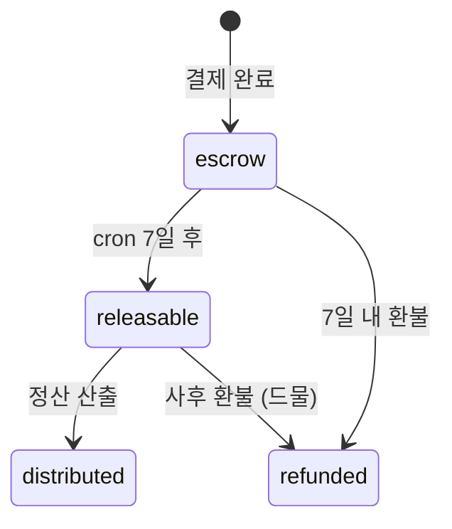
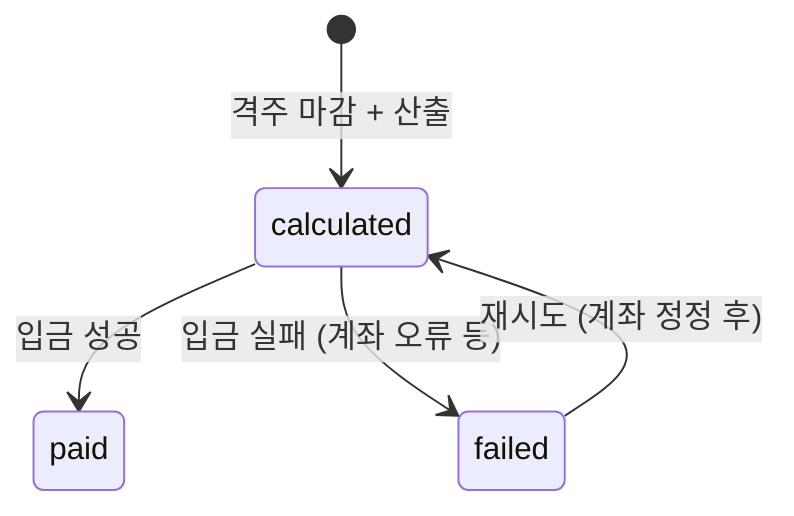

# 9. Payout — PayoutPeriod·PaymentLedger·DistributionEntry·MentorPayout·MentorBankAccount·TaxReport

정산 시스템. [3G 정산](../../partners/payout.html), [6C 본사 수익](../../expansion/revenue-share.html) 정책 반영.

## PayoutPeriod

**Purpose**: 격주 정산 기간. cron으로 자동 생성.
**Related PRDs**: [💪 정산](../mentor/2026-05-13-payout.html) · [🏢 정산 시스템](../platform/2026-05-13-payout-system.html)
**Lifecycle**: cron 생성 → 마감일 → 정산 산출 → 입금 완료

### Fields

| Field | Type | Required | Default | Description |
|---|---|---|---|---|
| id | String | ✓ | cuid() | PK |
| startDate | DateTime | ✓ | - | 격주 시작 (월요일) |
| endDate | DateTime | ✓ | - | 끝 (다음 주 일요일) |
| cutoffAt | DateTime | ✓ | - | 마감 시각 (endDate 23:59) |
| paymentDate | DateTime | ✓ | - | 입금 예정일 (cutoff + 영업일 2일) |
| status | String | ✓ | open | open/calculating/paid |
| createdAt | DateTime | ✓ | now() | |

### Validation
- endDate = startDate + 13일 (14일 격주)
- paymentDate = cutoffAt + 영업일 2일
- 한 시점에 1 active period (status='open')

### Common Queries
- 현재 격주: `WHERE status='open' AND NOW() BETWEEN startDate AND endDate`
- 다가오는 입금일: `WHERE status='paid' AND paymentDate > NOW()`

### Edge Cases
- 공휴일 → paymentDate 연기
- cutoff 시점 진행 중 세션 → 다음 격주로 이월

---

## PaymentLedger

**Purpose**: 결제 원장. 7일 escrow 후 정산 가능 상태로 전환. Phase 2 가맹 시작 시 본격 활용.
**Related PRDs**: [🏢 정산 시스템](../platform/2026-05-13-payout-system.html)
**Lifecycle**: 결제 직후 escrow → 7일 후 releasable → 정산 시 distributed

### Fields

| Field | Type | Required | Default | Description |
|---|---|---|---|---|
| id | String | ✓ | cuid() | PK |
| paymentId | String | ✓ | - | FK Payment (1:1) |
| memberId | String | ✓ | - | denorm |
| amount | Int | ✓ | - | |
| paidAt | DateTime | ✓ | - | |
| status | LedgerStatus | ✓ | escrow | escrow/releasable/refunded/distributed |
| releasedAt | DateTime? | - | null | 7일 후 자동 |

### Validation
- paymentId unique (1:1)
- status='releasable' 시 paidAt + 7일 ≤ NOW()
- distributed 후엔 변경 불가 (immutable)

### State Transitions

### Indexes
- `paymentId` (unique)
- `[status, paidAt]` — cron 7일 후 처리 대상

### Common Queries
- releasable 대상: `WHERE status='escrow' AND paidAt < NOW() - 7d` → 일괄 갱신
- 미분배 releasable: `WHERE status='releasable' AND distributedAt IS NULL`

---

## DistributionEntry

**Purpose**: 분배 단위 (멘토·본사·가맹점주 각각). Phase 1엔 mentor + hq만, Phase 2엔 franchisee 추가.
**Related PRDs**: [🏢 정산 시스템](../platform/2026-05-13-payout-system.html)
**Lifecycle**: 결제 분배 → pending → paid (정산 시)

### Fields

| Field | Type | Required | Default | Description |
|---|---|---|---|---|
| id | String | ✓ | cuid() | PK |
| paymentLedgerId | String | ✓ | - | FK |
| recipientType | String | ✓ | - | mentor / hq / franchisee |
| recipientId | String | ✓ | - | mentor id 또는 store id |
| amount | Int | ✓ | - | 분배액 (원) |
| appliedRate | Decimal(3,2)? | - | null | 비율 (멘토 50%, hq 30% 등) |
| status | String | ✓ | pending | pending / paid |
| paidInPeriodId | String? | - | null | MentorPayout/etc periodId 연결 |
| createdAt | DateTime | ✓ | now() | |

### Validation
- 한 ledger의 모든 distribution.amount 합 = ledger.amount

### Indexes
- `paymentLedgerId`
- `[recipientType, recipientId, status]`

### Common Queries
- 멘토 분배 미정산: `WHERE recipientType='mentor' AND recipientId=? AND status='pending'`
- 정산 산출: 격주별 분배 합계

### Edge Cases
- 환불 시 분배 회수 → status='pending' → 다음 격주에 차감 적용
- Phase 1 = mentor + hq만 분배 (가맹점주 분배 ❌)

---

## MentorPayout

**Purpose**: 멘토 격주 정산 (입금 단위).
**Related PRDs**: [💪 정산](../mentor/2026-05-13-payout.html) · [🏢 정산 시스템](../platform/2026-05-13-payout-system.html)
**Lifecycle**: 격주 산출 → calculated → paid (입금)

### Fields

| Field | Type | Required | Default | Description |
|---|---|---|---|---|
| id | String | ✓ | cuid() | PK |
| mentorId | String | ✓ | - | FK |
| periodId | String | ✓ | - | FK PayoutPeriod |
| sessionCount | Int | ✓ | - | 격주 누적 세션 수 |
| grossAmount | Int | ✓ | - | 회당 × 단가 |
| deductions | Int | ✓ | 0 | 노쇼·6h 취소 패널티 |
| netAmount | Int | ✓ | - | 실 입금액 (gross - deductions) |
| status | PayoutStatus | ✓ | calculated | calculated / paid / failed |
| paidAt | DateTime? | - | null | |
| transactionId | String? | - | null | 은행 송금 ID |
| failureReason | String? | - | null | |

### Validation
- (mentorId, periodId) unique
- netAmount = grossAmount - deductions
- netAmount ≥ 0

### State Transitions

### Indexes
- `[mentorId, periodId]` (unique)
- `[status, periodId]` — admin 처리 큐

### Common Queries
- 멘토 정산 이력: `WHERE mentorId=? ORDER BY periodId DESC`
- 미입금: `WHERE status='calculated' OR status='failed'`

---

## PayoutLineItem (세션별 라인)

**Purpose**: MentorPayout의 세션별 상세.
**Lifecycle**: MentorPayout 생성 시 함께 생성.

### Fields

| Field | Type | Required | Default | Description |
|---|---|---|---|---|
| id | String | ✓ | cuid() | PK |
| payoutId | String | ✓ | - | FK MentorPayout |
| sessionId | String | ✓ | - | FK Session |
| sessionDate | DateTime | ✓ | - | |
| rateApplied | Int | ✓ | - | 진행 당시 단가 (snapshot) |
| mentorTierAtTime | MentorTier | ✓ | - | 진행 당시 등급 |
| amount | Int | ✓ | - | 이 세션 정산액 |

### Indexes
- `payoutId` — 정산 명세 조회

---

## PayoutDeduction (차감)

**Purpose**: 노쇼·6h 취소 등 차감 사유 상세.
**Lifecycle**: MentorPayout 산출 시 추가.

### Fields

| Field | Type | Required | Default | Description |
|---|---|---|---|---|
| id | String | ✓ | cuid() | PK |
| payoutId | String | ✓ | - | FK |
| type | String | ✓ | - | no_show / late_cancel / tier_demotion |
| sessionId | String? | - | null | 관련 세션 |
| amount | Int | ✓ | - | 차감액 |
| reason | String | ✓ | - | 텍스트 |

---

## MentorBankAccount

**Purpose**: 멘토 정산 계좌. encrypted 저장.
**Related PRDs**: [💪 정산](../mentor/2026-05-13-payout.html)
**Lifecycle**: 등록 → 본인 확인 (1원 송금) → active → (변경) update

### Fields

| Field | Type | Required | Default | Description |
|---|---|---|---|---|
| mentorId | String | ✓ | - | PK (1:1) |
| bank | String | ✓ | - | "신한" |
| accountNumberEnc | String | ✓ | - | AES 암호화 |
| accountNumberLast4 | String | ✓ | - | 마스킹 표시용 |
| accountHolder | String | ✓ | - | 본인 명의 |
| verifiedAt | DateTime? | - | null | 1원 송금 확인 |
| lastUpdatedAt | DateTime | ✓ | now() | |

### Validation
- accountHolder = mentor.name (본인 명의)
- verifiedAt NULL 시 정산 ❌

### Indexes
- `mentorId` (PK)

### Edge Cases
- 계좌 변경 후 첫 입금 = 1원 송금 + 본인 확인
- 본인 명의 ≠ 멘토 명의 → 정산 차단
- 변경 후 진행 중인 정산 = 기존 계좌 유지

---

## TaxReport

**Purpose**: 사업소득 명세서 (월별, 원천세 3.3%).
**Related PRDs**: [💪 정산](../mentor/2026-05-13-payout.html)
**Lifecycle**: 월 1회 cron 생성 → PDF 발급 → 멘토 다운로드 가능

### Fields

| Field | Type | Required | Default | Description |
|---|---|---|---|---|
| id | String | ✓ | cuid() | PK |
| recipientType | String | ✓ | mentor | mentor / franchisee |
| recipientId | String | ✓ | - | |
| period | String | ✓ | - | "2026-04" |
| grossIncome | Int | ✓ | - | 총 수입 |
| withholding | Int | ✓ | - | 원천세 (3.3%) |
| netIncome | Int | ✓ | - | 실수령 |
| reportUrl | String? | - | null | PDF 다운로드 |
| generatedAt | DateTime | ✓ | now() | |

### Validation
- (recipientType, recipientId, period) unique
- withholding = grossIncome × 0.033 (반올림)
- netIncome = grossIncome - withholding

### Indexes
- `[recipientType, recipientId, period]` (unique)

### Common Queries
- 멘토 연간 누적: `SUM(grossIncome) WHERE recipientType='mentor' AND recipientId=? AND period LIKE '2026-%'`

### Edge Cases
- 원천세 신고 = 본사 책임 (멘토는 종합소득세 신고 시 사용)
- 사업소득 신고 누락 → 운영 알림

---

| 2026-05-13 | 초안 — Payout 7 모델 상세 명세 |
