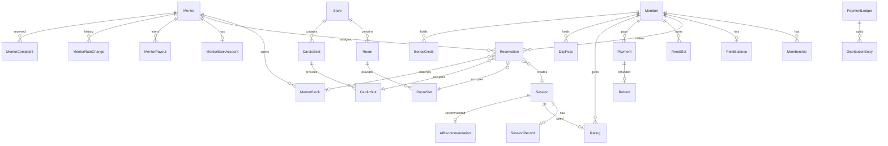
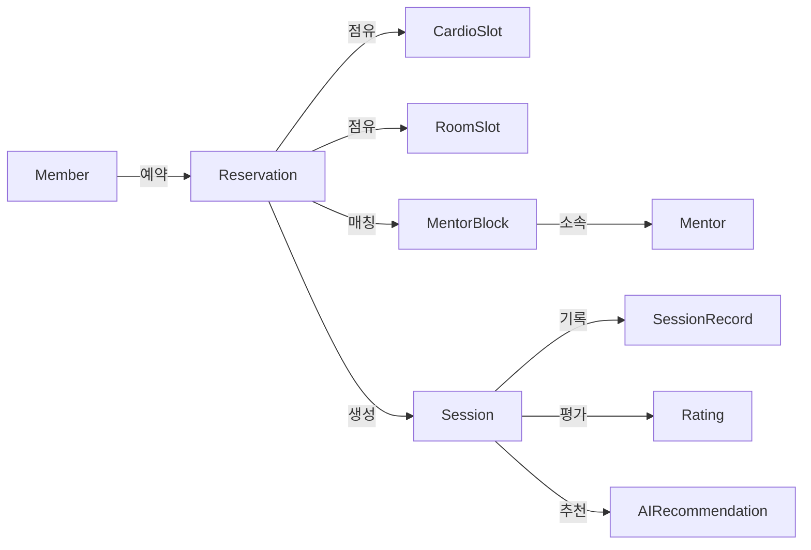
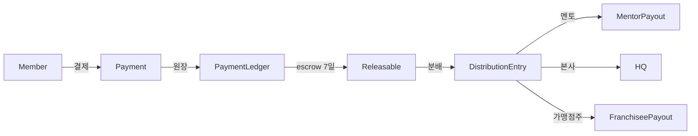
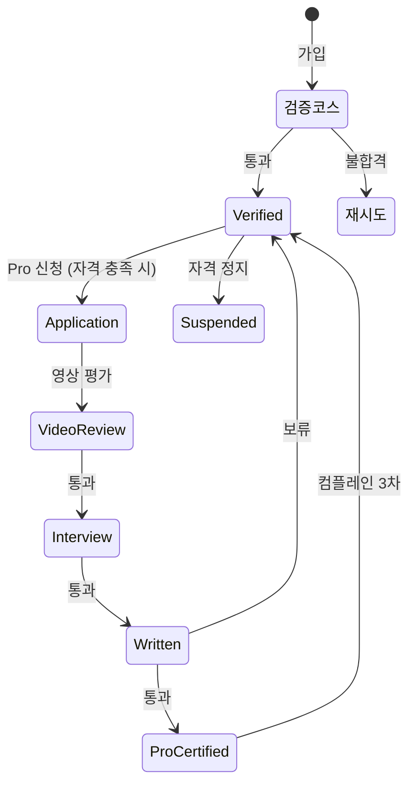

# ERD (Entity Relationship Diagram)

## 핵심 도메인 관계

## 그룹별 미니 ERD

### 예약 흐름

### 결제·분배 흐름

### 멘토 등급·심사 흐름

## 인덱스 추천

| 인덱스 | 이유 |
|---|---|
| `RoomSlot(roomId, startAt)` | 슬롯 조회 |
| `MentorBlock(mentorId, startAt)` | 멘토 슬롯 조회 |
| `MentorBlock(startAt, status)` | 매칭 가능 슬롯 검색 |
| `Reservation(memberId, startAt)` | 회원 예약 리스트 |
| `Reservation(mentorId, startAt)` | 멘토 일정 |
| `Payment(memberId, paidAt)` | 결제 내역 |
| `Membership(memberId, status)` | 활성 멤버십 조회 |
| `Rating(mentorId)` | 멘토 평점 |
| `MentorPayout(mentorId, periodId)` | 정산 조회 |

---

| 2026-05-13 | 초안 — 핵심 관계 + 그룹별 + 인덱스 추천 |
